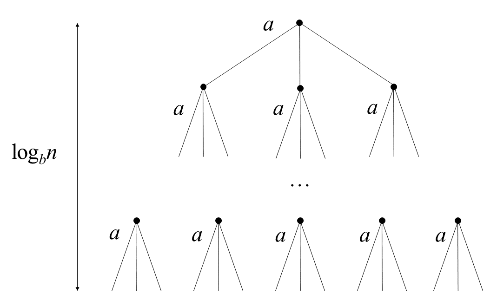
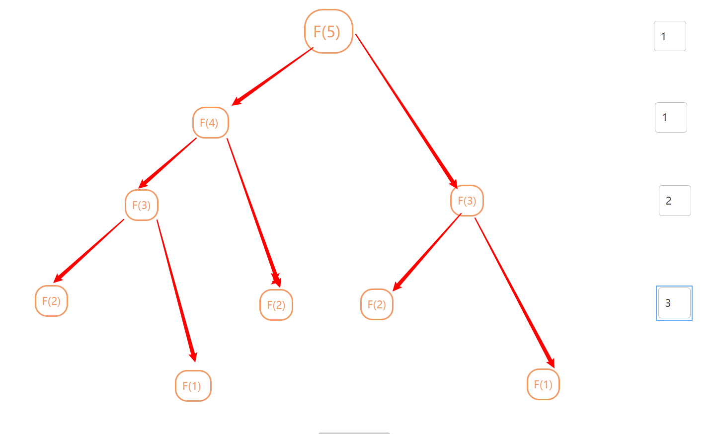

##  文本处理的流程



各位同学，大家好，今天我要来讲文本的处理流程细节

## 前向最大匹配

### 分词工具

<a style="font-size:150%;display: block;padding-left: 30%;">jiaba分词
    &emsp;https://github.com/fxsjy/jieba</a>

<a style="font-size:150%;display: block;padding-left: 30%;">哈工大LTP&emsp;https://www.ltp-cloud.com/</a>

<a width=500px  style="magin-left:50px;font-size:150%;display: block;padding-left: 30%;" >HanNLp&emsp;https://github.com/hankcs/HanLp/</a>

<a style="font-size:150%;display: block;padding-left: 30%;">SnowNLP&emsp;https://github.com/isnowfy/snownlp</a>


```python
# encoding=utf-8
import jieba

# 基于jieba的分词
seg_list = jieba.cut("贪心学院专注于人工智能教育", cut_all=False)
print("Default Mode: " + "/ ".join(seg_list))  

jieba.add_word("贪心学院") # 把贪心学院这个词添加入字典
seg_list = jieba.cut("贪心学院专注于人工智能教育", cut_all=False)
print("Default Mode: " + "/ ".join(seg_list)) 
```


#### 前向最大匹配算法


如上图所示，我们有案例  **我们有意见分歧** ，假设我们用 ✖️ 代表字典中没有该词组。✅代表含有此词组。且分词最大匹配长度为5，分词流程如下表所示，最终得到如下分词结果&emsp;  **我们|有意见|分歧**

| 我们经常有   | ✖️    | 经常有意见   | ✖️    | 有意见分歧   | ✖️    |
| :----------- | ---- | ------------ | ---- | ------------ | ---- |
| **我们经常** | ✖️    | **经常有意** | ✖️    | **有意见分** | ✖️    |
| **我们经**   | ✖️    | **经常有**   | ✖️    | **有意见**   | ✅    |
| **我们**     | ✅    | **经常**     | ✅    | **分歧**     | ✅    |

#### 代码

```python
#前向最大匹配法分词
 
def segment(str,maxlen,dict):
    len_str = len(str) #计算总共字符长度
    my_list = []  #存储前向分词结果
    while len_str >0 :
        temp = str[0:maxlen]
        while temp not in dict: #如果当前词不在字典里
            if len(temp) ==1:
                break
            temp = temp[0:len(temp)-1]  #则从后边删除一位
        my_list.append(temp)
        str = str[len(temp):]    #重新赋值str  第一次[我们有意见]找出我们，第二次剔除掉我们，这里用切片的方式剔除。
        len_str = len(str)
    return my_list
 
result = segment('我们经常有意见分歧',5,['我们','经常', '有','有意见','意见','分歧'])
print(result)
```

## 后向最大匹配


后向最大匹配算法与前向最大匹配算法差异不大，两者只是相反的过程。过程如下表所示。最终得到如下分词结果 &emsp;**我们|经常|有意见|分歧**

| **有意见分歧** | ✖️    | 经常有意见   | ✖️    | **们经常** | ✖️    |
| -------------- | ---- | ------------ | ---- | ---------- | ---- |
| **意见分歧**   | ✖️    | **常有意见** | ✖️    | **经常**   | ✅    |
| **见分歧**     | ✖️    | **有意见**   | ✅    | **我们**   | ✅    |
| **分歧**       | ✅    | **我们经常** | ✖️    |            |      |

### 最大匹配缺点


1. 属于贪心算法，只能得出局部最优解
2. 长度限制 词长过短话，会导致**中华人名共和国** 这种专有名词会被切错。过长则分词效率比较低下。
3. 掩盖分析歧义 举例来说**结合成分子时**，由于词的歧义最大匹配算法分词之后**结合|成分|子时**。

​	

## unigram分词



基于语义分割，就比最大匹配分词厉害的多了。语义分割将会生成所有可能的分割，然后通过比较分割结果概率大小，选出出现概率最大的结果。可能会生成的分割结果如下所示。
$$
s_1 = 经常|有|意见|分歧 \\
s_2 = 经常|有意见|分歧 \\
$$

采用unigram model分词，由于unigram分词之间，变量都是相互独立。不存在词组之间相互影响。如 **中华人民** 后面大概率是**共和国**。我们不考虑此种情况，各个变量都是相互**独立**。
$$
p(经常,有,意见,分歧) = p(经常)p(有意见)p(分歧) = 0.35 \\
p(经常,有,意见,分歧) = p(经常)p(有)p(意见)p(分歧) = 0.3  \\
$$
其实呢，在此有一个小**BUG**。就是在此**有意见**和**有**怎么统计呢，其实也是通过人工分词有监督学习的方法，那到底是怎么统计分词出现的频率呢？$\cfrac{单词频数}{文本单词}$。而大多时候一本$50w$字的书里面，这些词出现的频率会极低，由于计算机精确度问题，极小的数的几次方之后最后计算结果可能会直接为**None**。所以我们此处取$log$，注意：**编程中$log$底数为$e$。** 将此问题变成可计算问题。
$$
\log p(经常,有意见,分歧)= \log p(经常) + \log p(有意见) + \log p(分歧)
$$

## 维特比算法

