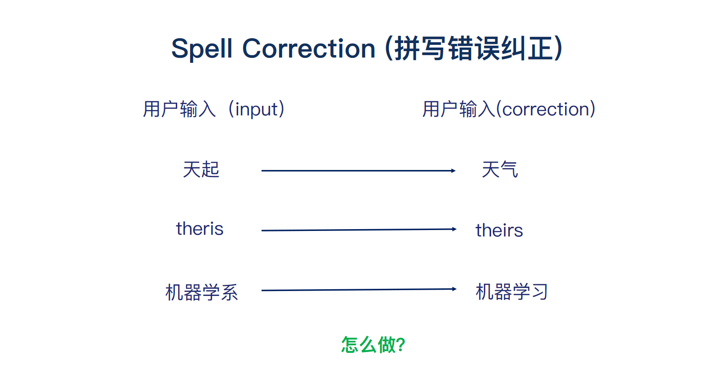
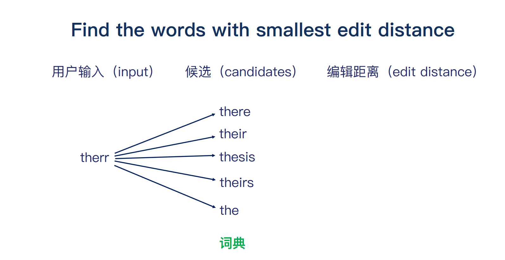
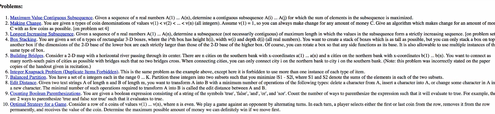
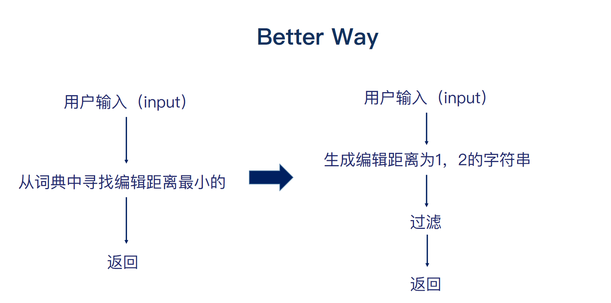
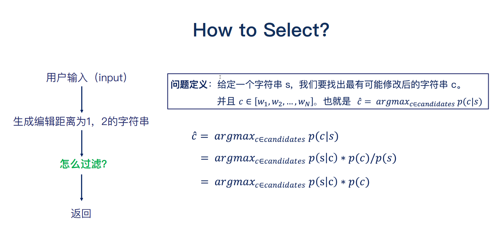

## 编辑距离



错别字分为两种情况，1. 本身就是错别字。2. 不是错别字而是不合适，语法错误啊，英语中的时态问题。



首先来阐述一下动态规划中的编辑距离问题吧。  给你两个单词 word1 和 word2，请你计算出将 word1 转换成 word2 所使用的最少操作数 。你可以对一个单词进行如下三种操作：1. 插入一个字符  2.  删除一个字符 3. 替换一个字符 

```markdown
输入：word1 = "intention", word2 = "execution"
输出：5
解释：
intention -> inention (删除 't')
inention -> enention (将 'i' 替换为 'e')
enention -> exention (将 'n' 替换为 'x')
exention -> exection (将 'n' 替换为 'c')
exection -> execution (插入 'u')
```

最后呢，计算出 **there** 和 **their**  编辑距离一样长，但是最后到底返回啥单词呢？此处就要多方面考虑。编辑距离、词频和上下文。具体使用根据你所建立的模型参数有关。

```

```


## 作业



## 过滤候选

我们通过动态规划的编辑距离，计算出需要返回的单词。问题也貌似迎刃而解了。但是文哲老师总是喜欢抛砖引玉。细细思考我们的候选单词是怎么来的，如果候选单词是整个字典的话，复杂度极高，直接pass这种想法。

此时就有一个绝妙的 **idea** 。我们基于用户的输出生成所有可能的单词。然后进行过滤就生成了我们的候选单词。



那么接下来就是过滤操作。思考一个问题，那就是怎么进行过滤呢？首先重申一下贝叶斯定理：
$$
p(x|y) = \cfrac{p(x,y)}{p(y)} =\cfrac{p(y|x)\cdot p(x)}{p(y)}
$$

其中 $c$ 是正确单词，$s$ 是用户输入。我们对候选单词进行过滤也就是使$p(s|c)*p(c)$概率最大化。



> [!TIP|style:flat|label:little-tip]
> 上图中的$p(s)$是经过词频统计后的常数项。对求极值 $\hat{c}$ 无影响
>
> 

> [!Note|style:flat]
> 机器是怎么判断用户输入的是apple的错误单词而不是banana的错误单词呢？

其实是这样的。 **banana** 事件是不可能发生的。假设用户输入 **appl**。我们通过编辑距离生成了许多单词。但是许多单词都是错误的，联想python里面字典。过滤最后剩下 **app、apple、apply** 等等。

| 用户1 | 用户2 | 用户3 | 用户4 | 用户5 | 用户6 | 用户7 | 用户8 |  用户9  |
| :---: | :---: | :---: | :---: | :---: | :---: | :---: | :---: | :-----: |
| appl  | apple | appl  |  app  | appla | apply | apple | apple | applyed |

注意：假定这里词典只有有 **app、apple、apply** 。在编辑距离为2的前提下，前8个单词都能生成以上**app、apple、apply** 这三个单词。**用户9**输入只能生成**apply**。用户9单词是**apply**独属的

> [!Note|style:flat]
> 有关$p(s|c)$的计算问题以及top-k呢？

假设上表就是数据仓库所有用户数据。$p(appl|apple) = \cfrac{2}{8}$，$p(appl|apply) = \cfrac{2}{9}$，$p(appl|app) = \cfrac{2}{8}$。$p(appl|apple) = p(appl|app)$怎么办呢？其实她两相等也并不影响  $\hat{c}$ 的计算。$\hat{c}$ 还受 $p(c)$ 影响。至于$p(x)$计算 采用unigram 模型计算概率。其实这里采用文本词频是并不理想的。比如 **Poison apple** 上下文具有关联性。而不是相互独立。具体采用哪种方法更建模及现实场景有关。

