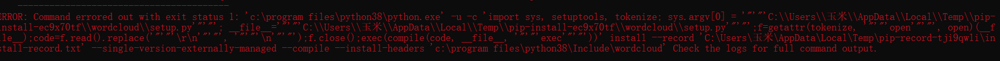
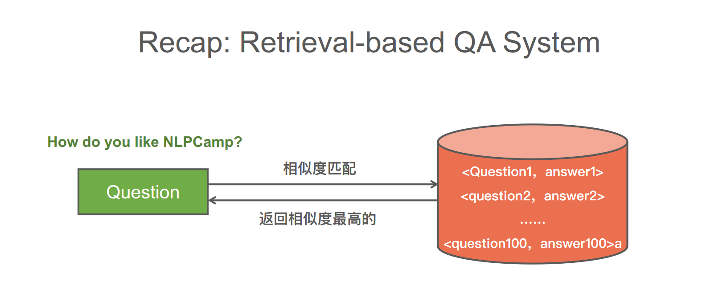
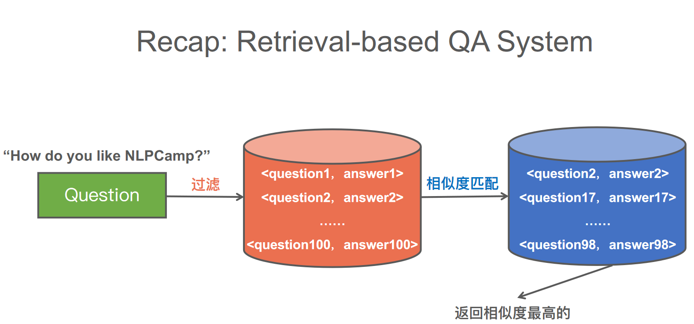

&emsp;&emsp;在我们建立一个模型并使用深度学习进行自然语言处理之前，我们必须弄清楚如何为计算机表示单词。在日常生活中，我们以多种方式来表达单词，通常是书面的符号(文字中的单词)或特定的声音(口语单词)。这两种方法都不能向计算机传递太多信息，因此我们需要采取不同的方法。机器学习的一个常见解决方案是将每个单词的意思表示为实数向量。

&emsp;&emsp;我们已经收集了些词条，并对这些间进行了计数并将它们归并成词干或者词源，接下来我可以做些有趣的事情了，分析词对些简单的任务有用，例如得到词用法的一些统计信息，或者者进行关键词检索。 但是我们想知道哪些词对于某简具体文档和整个语料库更重要。于是，我们可以利用这个“重要度”值，基于文档内的关键词重要度在语料库中寻找相关文档。

&emsp;&emsp;下一步我们要探索将词转换成连续值，而非只表示词出现数目的离散整数，也不只是表示特定词出现与否的二值位向量。将词表示为连续空间之后，就可以使用更令人激动的数学方法来对这些表示进行运算。我们的目标是寻找词的数值表示，这些表示在某种程度上刻画了词所代表的信息内容或重要度。

## One-Hot编码

&emsp;&emsp;One-Hot编码，又称为一位有效编码，独热编码，将所有需计算的文字组成一个向量，给出一个文字，它在向量中的位置标为1，其余都为0。

```python
# numpy表示
import numpy as np
sentence = "nlp_note is a good learning document for beginners"
token_sequence = str.split(sentence)
# set() 函数创建一个无序不重复元素集，可进行关系测试，删除重复数据，还可以计算交集、差集、并集等。
vocabulary = sorted(set(token_sequence))
num_tokens = len(token_sequence)
vocabulary_size = len(vocabulary)
onehot_vectors = np.zeros((num_tokens,vocabulary_size),int)
for i, word in enumerate(token_sequence):
	onehot_vectors[i, vocabulary.index(word)] = 1
print(' '.join(vocabulary))
print(onehot_vectors) 
```


```python
# pandas表示
import pandas as pd
df = pd.DataFrame(onehot_vectors,columns=vocabulary)
df[df == 0] = ' '
print(pd.DataFrame(onehot_vectors,columns=vocabulary))
print(df)
```

&emsp;&emsp;上述基于独热向量的句子表示方法保留了原始句子的所有细节，包括语法和词序。至此，我们已经成功地将词转换为计算机能够“理解”的数值。并且这些数值还是计算机非常喜欢的一类数值:二值数字0或1。但是，相对于上述的短句子而言的整个表格却很大。如果考虑到这一点，大家可能已经对文件的大小进行了扩充以便能够存储上述表格。但是，对长文档来说这种做法不太现实，此时文档的大小(上述向量组成的表格的长度)会急剧增加。英语中包含至少20 00个常用词，如果还要考虑人名和其他专用名词的话，词的数量就会达到数百万个。对于要处理的每篇文档，其独热表示方法都需要一个 新的表格(矩阵)。这基本上相当于得到了文档的原始“映像“。

## TF-IDF

**TF-IDF(term frequency–inverse document frequency)** 是一种用于信息检索与数据挖掘的常用加权技术，常用于挖掘文章中的关键词，而且算法简单高效，常被工业用于最开始的文本数据清洗。

重要说明 **TF-IDF** 表示词项频率 **(term frequency)** 乘以逆文档频率 **( inverse document frequency )** 词项频率是指每个词在某篇文档中的出现次数。而逆文档频率指的是文档集合中的文档总数除以某个词出现的文档总数。


$$
TF=某个词在文章中出现的总次数
$$

但是考虑到每篇文章的长短是不同的，所以我们可以把上述内容进行一个标准化：
$$
TF=某个词在文章中出现的总次数/文章的总词数
$$

```python
import numpy as np
from collections import Counter
import jieba

vocabulary = ["我们","又","去","爬山","今天","你们","昨天","跑步"]
sentence = "你们今天又去爬山又去跑步"
seg_list = jieba.cut(sentence, cut_all=False)
bag_of_word = Counter(seg_list)
vector = np.zeros(len(vocabulary),int)

for  word,value in bag_of_word.items():
    print(word,value)
    vector[vocabulary.index(word)] = value # 布尔类型value=1
print(vector)
print(vector/len(vocabulary))
```

```python
from collections import Counter
from nltk.tokenize import TreebankWordTokenizer

tokenizer = TreebankWordTokenizer()
from nlpia.data.loaders import kite_text

tokens = tokenizer.tokenize(kite_text.lower())
tokens_counts = Counter(tokens)
print(tokens_counts)
# Counter({'the': 26, 'a': 20, 'kite': 16, ',': 15,...})

import nltk
nltk.download("stopwords",quiet=True)
stopwords = nltk.corpus.stopwords.words('english')

tokens = [x for x in tokens if x not in stopwords]
kite_counts = Counter(tokens)
print(kite_counts)
# Counter({'kite': 16, ',': 15, 'kites': 8, 'wing': 5,..})

document_vector = []
doc_length = len(tokens)
for key,value in kite_counts.most_common():
    document_vector.append(value/doc_length)
print(document_vector)
```

**TreebankWordTokenizer** 分词的缺点是会返回一个 "kite."(带有标点符号)，暂且我们忽略此情况，后续学习将会有更精确的分词。

### **提醒**




在 **pip install package** 许多人会遇见以上这种情况，笔者在实习玩 **jetson** 的时候基本弄清楚报错原理。报错原因是因为电脑中缺少相应的 **C++** 环境。**pip install package** 有时候是下载已经编译好的arm架构或者x86架构的whl文件。whl文件是官方编译好发布上去的文件，编译好的whl文件可以直接安装，而 **pip**镜像源有时候缺少whl文件，下载的 **package** 的源码，需要我们电脑自行编译，你会发现会出现一段文字 **running setup.py** ，此时就正在编译。报错原因就是缺少 **C++** 环境，无法编译。[官网下载Visual Studio](https://visualstudio.microsoft.com/zh-hans/thank-you-downloading-visual-studio/?sku=Community&rel=16)，勾选使用 **C++** ，MSVC是python的编译器，在下载 **Tensorflow** 选择版本的时候会看见，**CMake** 和 **MSBuild** 也是编译工具。比如下载 **PYQT5** 的时候会看见。


**TF-IDF的主要思想是**：如果某个词或短语在一篇文章中出现的频率TF高，并且在其他文章中很少出现，则认为此词或者短语具有很好的类别区分能力，适合用来分类。TFIDF 实际上是： **TF \* IDF** ，**TF** 词频 **(Term Frequency)** ，**IDF** 反文档频率 **(Inverse Document Frequency)** 。**TF**表示词条在文档d中出现的频率（另一说：**TF词频(Term Frequency)指**的是某一个给定的词语在该文件中出现的次数）。**IDF**的主要思想是：如果包含词条t的文档越少，也就是n越小，**IDF**越大（见后续公式），则说明词条t具有很好的类别区分能力。如果某一类文档C中包含词条t的文档数为m，而其它类包含t的文档总数为k，显然所有包含t的文档数 **n=m+k**，当m大的时候，n也大，按照IDF公式得到的I**DF**的值会小，就说明该词条t类别区分能力不强。（另一说：**IDF 反文档频率(Inverse Document Frequency)是指果包含词条的文档越少，IDF 越大，**则说明词条具有很好的类别区分能力。）但是实际上，有时候，如果一个词条在一个类的文档中频繁出现，则说明该词条能够很好代表这个类的文本的特征，这样的词条应该给它们赋予较高的权重，并选来作为该类文本的特征词以区别与其它类文档。这就是 **IDF** 的不足之处.
$$
IDF=log(\cfrac{语料库所有文档疏数目}{出现这个词的文章数目})
$$


如果某一个生僻词没有在训练集中出现，就会导致分母为0，所以我们需要做一些平滑：
$$
IDF=log(\cfrac{语料库所有文档疏数目+1}{出现这个词的文章数目+1})
$$

```python
# CountVectorizer、TfidfTransformer
from sklearn.feature_extraction.text import CountVectorizer
 
corpus = ['This is the first document.',
    'This document is the second document.',
    'And this is the third one.',
    'Is this the first document?']
 
vectorizer = CountVectorizer()      # ()这里不提供先验词典
# vectorizer.fit(corpus)            # 先fit训练传入的文本数据
# X = vectorizer.transform(corpus)      # 然后对文本数据进行标记并转换为稀疏计数矩阵
X = vectorizer.fit_transform(corpus)        # 可以fit、transform一起使用替代上面的两行
 
print(vectorizer.get_feature_names())   # 获得模型直接分析数据找到的词汇量（上面单词的集合）
print(X.toarray())  # 直接打印X输出的是每个词的位置
from sklearn.feature_extraction.text import TfidfTransformer
 
transform = TfidfTransformer()    # 使用TF-IDF（词频、逆文档频率）应用于稀疏矩阵
Y = transform.fit_transform(X)    # 使用上面CountVectorizer处理后的 X 数据
print(Y.toarray())                # 输出转换为tf-idf后的 Y 矩阵，同样直接打印 Y 输出每个数据的位置

# TfidfVectorizer
from sklearn.feature_extraction.text import TfidfVectorizer

tfidf = TfidfVectorizer()		# 先后调用CountVectorizer和TfidfTransformer两种方法（简化了代码，但运算思想还是不变）
result = tfidf.fit_transform(corpus)
print(result.toarray())
print(tfidf.get_feature_names())
```

## 文本相似度

### 1 基于关键词匹配

#### 1.1 N-gram 相似度

　　基于N-Gram模型定义的句子（字符串）相似度是一种模糊匹配方式，通过两个长得很像的句子间的“差异”来衡量相似度。
　　N-Gram相似度的计算是指按长度N切分原句得到词段，也就是原句中所有长度为N的子字符串。对于两个句子S和T，则可以从共有子串的数量上去定义两个句子的相似度。
　　
$$
Similarity=|GN(S)|+|GN(T)|−2∗|GN(S)∩GN(T)|
$$
　　其中， GN(S)和 GN(T)分别表示字符串S和T中N-Gram的集合，N一般取2或3。字符串距离越近，它们就越相似，当两个字符串完全相等时，距离为0。

#### 1.2 Jaccard 相似度

　　Jaccard相似度的计算相对简单，原理也容易理解。就是计算两个句子之间词集合的交集和并集的比值。该值越大，表示两个句子越相似，在涉及大规模并行运算的时候，该方法在效率上有一定的优势，公式如下：
　　
$$
J(A,B)=|A∩B||A∪B|
$$

#### 2 基于向量空间

#### 2.4 相似度计算

　　相似度就是比较两个事物的相似性。一般通过计算事物的特征之间的距离，如果距离小，那么相似度大；如果距离大，那么相似度小。 
 　　问题定义：有两个对象X、Y，都包括N维特征，$X=(x_{1},x_{2},x_{3},..,x_{n}), Y=(y_{1},y_{2},y_{3},..,y_{n})$计算X和Y的相似性。常用的方法如下:

#### 2.4.1 欧式距离

　　欧氏距离是最常用的距离计算公式，衡量的是多维空间中各个点之间的绝对距离，当数据很稠密并且连续时，这是一种很好的计算方式。 
 　　因为计算是基于各维度特征的绝对数值，所以欧氏度量需要保证各维度指标在相同的刻度级别，如在KNN中需要对特征进行归一化。 
 　　
$$
d = \sqrt{\sum_{i=1}^{n}(x_{i}-y_{i})^{2}}
$$


#### 2.4.2 曼哈顿距离

　　曼哈顿距离也称为城市街区距离(City Block distance)。 
 　
$$
d = \sum_{i=1}^{n}|x_{i}-y_{i}|
$$


#### 2.4.3 余弦相似度

　　余弦相似度用向量空间中两个向量夹角的余弦值作为衡量两个个体间差异的大小。相比距离度量，余弦相似度更加注重两个向量在方向上的差异，而非距离或长度上。 
 　　


$$
cos\theta  = \frac{\sum_{i=1}^{n}x_{i}*y_{i}}{\sqrt{\sum_{i=1}^{n}x_{i}^{2} \sum_{i=1}^{n}y_{i}^{2}}}
$$

## 分布式词向量

## 倒排表



最简单的问答系统：就是给定一个问题，去语料库中匹配**相似度最高**的问题所对应的答案，语料库每个样本是：< 问题，答案 >

缺点： 假如我们语料库有 N 个 < 问题，答案> 对，那么，对于每个用户提出的问题，我们需要 计算 N 次相似度，才能返回最高相似度的。
所以他的复杂度为：O(N)* (每次相似度计算的复杂度)

解决的核心思路：层次过滤方法
复杂度：过滤器1 < 过滤器2 < 过滤器3 < 过滤器4 < … < 余弦相似度的复杂度

如图：通过第一层过滤，我们现在只有100个 < 问题，答案 >对，再经过一层过滤假设我们只有10个< 问题，答案 >对（蓝色圆柱体）
这个复杂度：2 x 过滤器复杂度 + 10 x 余弦相似度复杂度
一般过滤器复杂度很低，我们可以忽略，只考虑（10 x 余弦相似度复杂度）

那么这个过滤器如何做呢？



创建倒排索引，分为以下几步：

1）创建文档列表：首先对原始文档数据进行编号（DocID），形成列表，就是一个文档列表

<div align="center"></div> 

2）创建倒排索引列表l 然后对文档中数据进行分词，得到词条。对词条进行编号，以词条创建索引。然后记录下包含该词条的所有文档编号（及其它信息）。

<div align="center"></div> 

 

搜索的过程：当用户输入任意的词条时，首先对用户输入的数据进行分词，得到用户要搜索的所有词条，然后拿着这些词条去倒排索引列表中进行匹配。找到这些词条就能找到包含这些词条的所有文档的编号。然后根据这些编号去文档列表中找到文档

---

参考博客

1. [浅析文本相似度](https://blog.csdn.net/qq_28031525/article/details/79596376)
2. [一文了解倒排表](https://blog.csdn.net/weixin_46425692/article/details/108592068)
3. [倒排索引为什么叫倒排索引？](https://www.zhihu.com/question/23202010)

