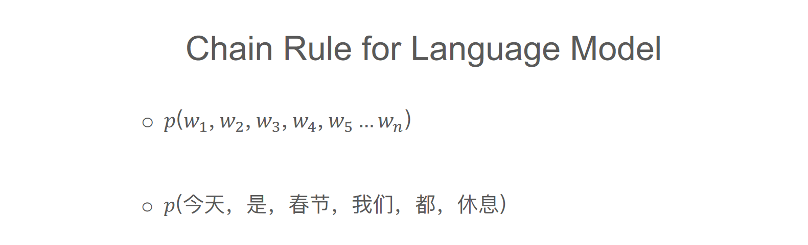
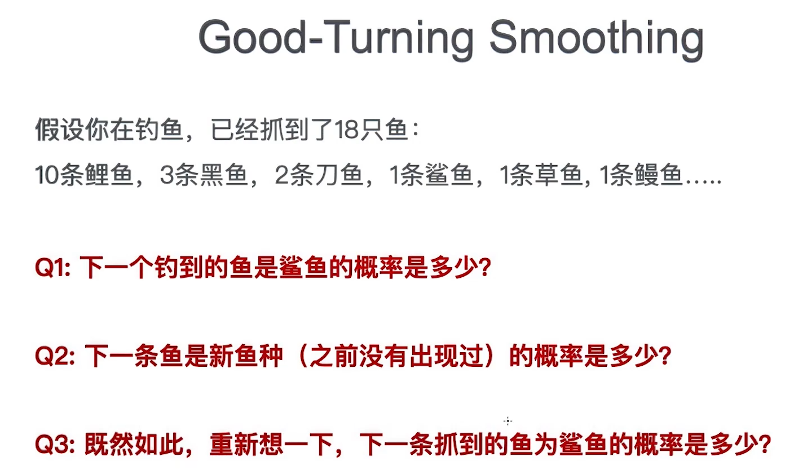

统计语言模型是一个单词序列上的概率分布，对于一个给定长度为m的序列，它可以为整个序列产生一个概率 $P(w_1,w_2,w_3...,w_m)$ 。其实就是想办法找到一个概率分布，它可以表示任意一个句子或序列出现的概率。目前在自然语言处理相关应用非常广泛，如语音识别, 机器翻译, 词性标注, 句法分析等。传统方法主要是基于统计学模型，最近几年基于神经网络的语言模型也越来越成熟。

要判断一段文字是不是一句自然语言，可以通过确定这段文字的概率分布来表示其存在的可能性。 语言模型中的词是有顺序的，给定m个词看这句话是不是一句合理的自然语言，关键是看这些词的排列顺序是不是正确的。所以统计语言模型的基本思想是计算条件概率。比如一段文字有${w_1,w_2,w_3...,w_m}$这m个词组成，看看是不是一句话，就可以用下面的公式计算其联合概率： 
$$
P(w_1,w_2,w_3...,w_m)=P(w_2|w_1)P(w_3|w_1,w_2)...P(w_m|w_1,w_2,...w_m-1)
$$

$$
\begin{aligned}
p(今天,是,春节,我们,都,休息)=&p(今天)*p(是|今天)*p(春节|今天,是)*p(我们|今天,是,春节)\\
&*p(都|今天,是,春节,我们)*p(休息|今天,是,春节,我们,都)
\end{aligned}
$$


在实际操作中，如果文本较长，$P(w_i|w_1,w_2,...w_i-1)$的估计会非常困难，所以就出现了一个简化模型N-gram语言模型：当前词只和它前面的n个词有关，与更前面的词无关，上面的式子就可以写成： 
$$
P(w_i|w_1,w_2,...w_i-1)=P(w_i|w_{i-(n-1)},...,w_{i-1})
$$
试想一下，如果不约束文本的长度，那后面的条件概率几乎是无法计算的，因为数量太多了，不仅有这个问题，还有如果 $w_1,w_2,w_3,...w_n$组成的序列不是一个常用的序列，在预料中找不到这样的词序组合，那对应序列算出来的概率会很小很小，但是你也不能不计算他，所以就会面临你要计算非常多的概率，但是计算出来的大部分值非常小，甚至接近于0，而这些接近于0的概率还不能舍弃，必须存在，这样就会造成数据稀疏的问题。

n-gram语言模型解决了用普通的条件概率计算句子概率参数太多难以训练的问题，理论上来说n取得越大保留的词序信息就越多，生成的句子越合理，但如果n取得比较大，同样会面临数据稀疏的问题，n-gram 模型解决了参数太多难以训练的问题，但没有解决数据稀疏的问题。

之所以存在数据稀疏的问题，是因为我们想把n取得大一点来更多的保留词序信息，但n太大会导导致$w_1,w_2,w_3,...w_n$这个序列在语料中很少出现或者根本不出现，（根据经验也知道太长的一句话在语料中出现的次数不是那么多，要远远小于2，3个词出现的次数）造成计算出的条件概率接近于0，那算出的句子的概率也是接近于0，这个语言模型就没法用了，这是数据稀疏导致的训练出的语言模型无法用的原因。

## Unigram model

**Unigram models** 也即一元文法模型，它是一种上下文无关模型。该模型仅仅考虑当前词本身出现的概率，而不考虑当前词的上下文环境。上下文之间相互独立，其概率形式为 
$$
P(w_1,w_2,w_3...,w_m)=P(w_1)*P(w_2)*P(w_3)*\cdots*P(w_m)
$$
即一个句子出现的概率等于句子中每个单词概率乘积。 以一篇文档为例，每个单词的概率只取决于该单词本身在文档中的概率，而文档中所有词出现的概率和为1，每个词的概率可以用该词在文档中出现的频率来表示.通常有些单词没有在语料库中出现。

## n-gram model

**ngram** 是一个最多包含n个元素的序列，这些元素从由它们们组成的序列(通常是字符串)中规取而成。一般来说， **n-grm** 的“元素” 可以是字符、音节、词，甚至是像 **ATGC** 等表示DNA序列的符号。

本节我们只关注词的 **n-grm** 而不关注 **ocr** 领域的字符的 **n-gram**， **n-gam** 不-定要求像复合词样有特定的含义，而仅仅要求出现频率足够高以引起词条计数器的注意。

为什么要使用 **n-gram** 呢?正如前面所看到的那样，当一个词条序列向量化成词袋向量时，它丢失了词序中所包含的很多含义。将单词条的概念扩展到多词条构成的 **n-gram** ，NLP流水线就可以保留语句词序中隐含的很多含义。例如，否定词 **“no”** 就会和它所属的相邻词在一起。如果分词不考虑n-gram, 那么 **“no”** 就会自由漂移，面不会固定在某几个词周围，其否定的含义可能就会与整个句子甚至整篇文档，而不是只与某几个相邻词关联。相比于词袋向量中的 **l-gam,2-gram** . **“was not”** 保留了两个独立词 **"not”** 和 **“was”** 的更多部分的含义。在流水线中如果把一个词和其相邻词捆绑起来，就会使词的一部分 上下文被保留。

针对参数空间过大的问题，Markov假设是解决该问题的有效方法，即随意一个词出现的概率只与它前面出现的一个或者几个词有关。一个句子${w_1,w_2,w_3...,w_m}$的概率表示如下：
$$
P(w_1,w_2,\cdots,w_m) = \prod_{i=0}^m P(w_i|w_1,\cdots,w_{i-1}) = \prod_{i=0}^m P(w_i|w_{i-(n-1)},\cdots,w_{i-1})
$$

```python
import re
from nltk.util import ngrams
from nltk.tokenize import TreebankWordTokenizer

# 正则表达式删除分c
sentence = "Thomas Jefferson began building Monticello at the age of 26"
pattern = re.compile(r"([-\s.,;!?])+")
tokens = pattern.split(sentence)
tokens = [x for x in tokens if x and x not in '- \t\n.,;!?']
print(list(ngrams(tokens,2)))
```


## 语言模型性能评价

如何衡量一一个语言模 型的好坏呢?一种方 法是将其应用于具体的外部任务(如机器翻译)，并根据该任务上指标的高低对语言模型进行评价。这种方法也被称为“外部任务评价”，是最接近实际应用需求的一种评价方法 。但是，这种方式的计算代价较高，实现的难度也较大。因此，目前最为常用的是基于困惑度 **( Perplexity,PPL)** 的“内部评价”方式。

为了进行内部评价，首先将数据划分为不相交的两个集合，分别称为训练集和测试集,其中训练集用于估计语言模型的参数。由该模型计算出的测试集的概率则反映了模型在测试集上的泛化能力”。

困惑度（perplexity）的基本思想是：**给测试集的句子赋予较高概率值的语言模型较好,当语言模型训练完之后，测试集中的句子都是正常的句子，那么训练好的模型就是在测试集上的概率越高越好，**公式如下：
$$
perplexity = p(w_1,w_2,w_3,\cdots,w_m)^{-1/m}  \\
= \sqrt[m]{\prod_{i=1}^m \cfrac{1}{p(w_i|w_1,w_2,\cdots,w_{i-1})}}
$$
根号内是句子概率的倒数，所以显然 **句子越好（概率大），困惑度越小，也就是模型对句子越不困惑。** 公式中$i$的确定与我们采用 **n-gram** 模型有关，这样我们也就理解了这个指标的名字。简单来说，**perplexity** 刻画的是语言模型预测一个语言样本的能力，比如已经知道了 $(w_1,w_2,\cdots,w_m)$ 这句话会出现在语料库之中，那么通过语言模型计算得到这句话的概率越高，说明语言模型对这个语料库拟合的越好。

对于 **bigram** 模型而言：
$$
perplexity =  (\prod_{i=1}^mP(w_i|w_{i-1}))^{-\cfrac{1}{m}}
$$


在实际计算中，考虑到相比较乘积求平方根的方式，采用加法的形式可以加速计算，同时避免概率乘积数值过小而导致浮点数向下溢出的问题。
$$
PPL = 2^{-\frac{1}{m}\sum_{i=1}^m \log_2P(w_i|w_{i-1})}
$$


在数学上，**log perplexity** 可以看作真实分布与预测分布之间的 **交叉熵 Cross Entropy**, 交叉熵描述了两个概率分布之间的一种距离，假设 $x$ 是一个离散变量， 是 $u(x)\quad v(x)$ 两个与 $x$ 相关的概率分布，那么  之间$u \quad v$的交叉熵 的定义是分布 $u$下  的期望$-(\log v(x))$值：
$$
H(u,v)=E_u[-log v(x)] =-\sum_x u(x)\log v(x)
$$
我们把 $x$ 看作是单词， $u(x)$ 表示每个位置上单词的真实分布，
$$
u(x|w_1,w_2,\cdots,w_{i-1}) = 
\begin{cases} 
1 ,x=w_i \\ 0,x\neq w_i
\end{cases}
$$
$v(x)$ 是模型的预测分布 $p(w_i|w_1,w_2,\cdots,w_{i-1})$ ，那么即有


$$
\begin{aligned}
& H(u,v) = -\sum_x u(x)\log v(x)  \\
& =-\cfrac{1}{m}\sum_{i-1}^{m}(\sum_x u(x|w_1,\cdots,w_{i-1})p(w_i|w_1,w_2,\cdots w_{i-1}))  \\
& =-\cfrac{1}{m}\sum_{i-1}^{m}(1\times p(w_i|w_1,w_2,\cdots,w_{i-1})+\sum_{x\neq w_i}0\times p(w_i|w_1,w_2,\cdots,w_{i-1})  \\
& = -\cfrac{1}{m}\sum_{i-1}^{m}(1\times p(w_i|w_1,w_2,\cdots,w_{i-1})  \\
& = log(perplexity(S))
\end{aligned}
$$
因此 **log perplexity** 和交叉熵是等价的。

## Smooth 平滑

### Add-one (Laplace) smoothing

Add-one  是最简单、最直观的一种平滑算法，为了解决训练 **n-gram** 模型中一些从未出现过单词概率为 **0** 的问题，为了使训练时任何一个N-gram在训练预料至少出现一次（即规定没有出现的，在语料中也出现一次），因此：$Count\_new(n-gram) = Count\_old(n-gram)+1;$

于是对于n-gram的模型而言，假设$V$是所有可能的不同的N-gram的类型个数，即词典库中词汇时，那么根据贝叶斯公式有
$$
P(w_i|w_{i-n+1},\cdots,w_{i-1}) = \frac{C(w_{i-n+1},\cdots,w_i)+1}{C(w_{i-n+1},\cdots,w_{i-1})+V}
$$
当然这里的n-gram的可以相应的改成uingram和bigram表达式，并不影响。其中$C(x)$为$x$在训练中出现的次数，$w_i$为给定的训练数据中第 $i$ 个单词。

可是为什么分子要加 $V$ 呢?为了使得$\sum_{w_{i}\in \Omega}^{}  \frac{C(w_{i-1}, w_{i}) + 1}{C(w_{i-1})+v}$为1啊，物理意义就是，词典库中有v个词汇，后$w_{i-1}$面接的单词在这v个词汇之中的概率要为1，也就是加起来为1。

Add-one平滑算法然而它也并不完美，由于训练语料中未出现的n-gram数量太多，平滑后，所有未出现的占据了整个概率分布的一个很大的比例，因此，在自然语言处理中，Add-one给语料库中没有出现的n-gram分配了太多的概率空间。此外所有没有出现的概率相等是不是合理，一篇有关美食的文章，我们更希望下文更食物有关，而不是电子书籍，这种问题也是需要考虑的。

### Add-k smoothing

由Add-one衍生出来的另一种算法就是Add-k，既然我们认为加1有点过了，那么我们可以选择一个小于1的正数k，概率计算公式就可以变成如下表达式：
$$
P(w_i|w_{i-n+1},\cdots,w_{i-1}) = \frac{C(w_{i-n+1},\cdots,w_i)+k}{C(w_{i-n+1},\cdots,w_{i-1})+kV}
$$
它的效果通常会比Add-one好，但是依旧没有办法解决问题，实践中，k必须认为的给定，此时需要调参侠或者梯度下降一个个的去试了

### Interpolation插值法

在使用插值的时候，我们把不同阶层的n-gram的模型线性叠加组合起来之后再使用，简单的如trigram的模型，为了解决新事物概率相同的问题，按照如下的方式进行叠加：
$$
P (w_{n}|w_{n-1},w_{n-2}) = \lambda _{1}P (w_{n}|w_{n-1},w_{n-2})  +\lambda _{2}P (w_{n}|w_{n-1})+\lambda _{3}P (w_{n})
$$
其中 $\lambda _{1},\lambda _{2},\lambda _{3}$ 是可以变化的参数，且满足 $\lambda _{1} + \lambda _{2} + \lambda _{3} = 1$

我们有语料库

```markdown
in the bathroom		the kitchen		kithcen		arboretum
```

如果通过add-one smoothing，我们计算 **P(kitchen|in the)** 和 **P(arboretum|in  the)** 的值是一样的，因为他们的频次都是0，所以值都是(0+1)/(1+ 7) = 1/8。但是我们直观感觉，**in the kitchen**  肯定要比 **in the arboretum** 的概率要大得多，所以我们计算 **tri-gram** 模型的概率的时候，如果能够考虑 **bi-gram** 和 **unigram** 的概率，那么就能解决概率相同的问题。 

### good-turning smoothing



首先我们看问题，

Q1：总共18条鱼，顾名思义1/18

Q2：还有可能出现新鱼种，我们用鲨鱼、草鱼、鳗鱼去估计新鱼种概率。有多大概率下次也是1，而不是10或者3。

Q3：在样本空间里面预留一部分给新鱼种了，为了使得样本空间之和大于1，所以不能再用1/18表示接下来钓到鲨鱼的概率了。

对于没有出现的单词：$P = \frac{N_1}{N}$，对于出现c次的单词：
$$
P = \frac{(c+1)N_{C+1}}{N_C*N}
$$
这里的 $N_c$ 指的是在预料集中出现频次为c的单词的个数，用专业术语解释如下

<div align="center"></div> 

---

参考博客

1. [求通俗解释NLP里的perplexity是什么？](https://www.zhihu.com/question/58482430)

