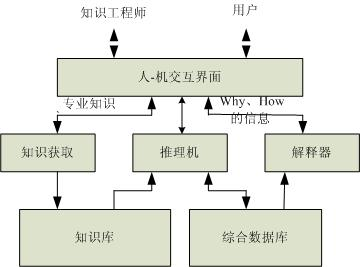
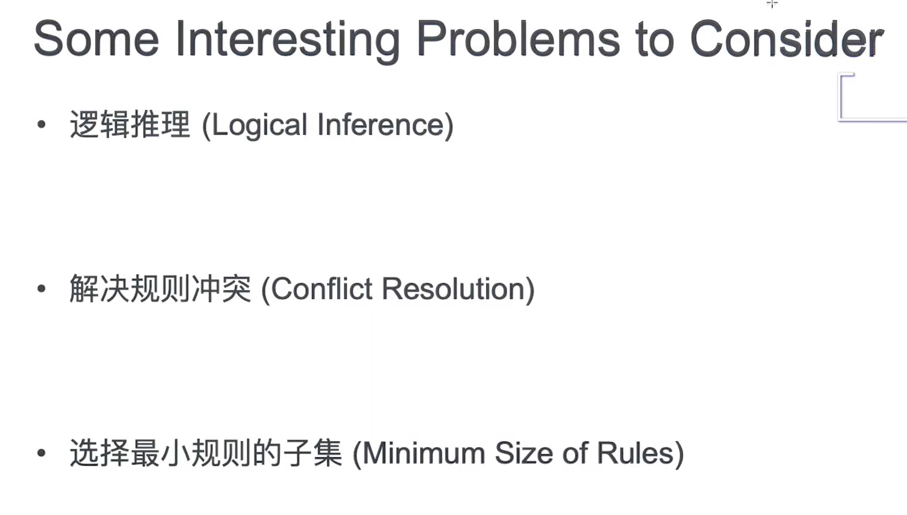

## 什么是专家系统(ES) 

　　专家系统是一类具有专门知识和经验的计算机智能程序系统，通过对人类专家的问题求解能力的建模，采用人工智能中的知识表示和知识推理技术来模拟通常由专家才能解决的复杂问题，达到具有与专家同等解决问题能力的水平。这种基于知识的系统设计方法是以知识库和推理机为中心而展开的，即
$$
专家系统 = 		知识库 + 		推理机
$$
​		它把知识从系统中与其他部分分离开来。专家系统强调的是知识而不是方法。很多问题没有基于算法的解决方案，或算法方案太复杂，采用专家系统，可以利用人类专家拥有丰富的知识，因此专家系统也称为基于知识的系统（Knowledge-Based Systems）。一般说来，一个专家系统应该具备以下三个要素：

​		（1）具备某个应用领域的专家级知识；

​		（2）能模拟专家的思维；

​		（3）能达到专家级的解题水平。

专家系统与传统的计算机程序的主要区别如表7.1所示。

|   列项   | 传统的计算机程序 |    专家系统    |
| :------: | :--------------: | :------------: |
| 处理对象 |       数字       |      符号      |
| 处理方法 |       算法       |     启发式     |
| 处理方式 |      批处理      |     交互式     |
| 系统结构 |  数据和控制集成  | 知识和控制分离 |
| 系统修改 |        难        |       易       |
| 信息类型 |      确定性      |    不确定性    |
| 处理结果 |      最优解      |    可接受解    |
| 适用范围 |      无限制      |  封闭世界假设  |

​		建造一个专家系统的过程可以称为“知识工程”，它是把软件工程的思想应用于设计基于知识的系统。知识工程包括下面几个方面：

​	（1）从专家那里获取系统所用的知识（即知识获取）

​	（2）选择合适的知识表示形式（即知识表示）

​	（3）进行软件设计

​	（4）以合适的计算机编程语言实现。

## 专家系统的发展史

​		1965年斯坦福大学的费根鲍姆（E.A.  Feigenbaum）和化学家勒德贝格（J. Lederberg）合作研制DENDRAL系统，使得人工智能的研究以推理算法为主转变为以知识为主。20世纪70年代，专家系统的观点逐渐被人们接受，许多专家系统相继研发成功，其中较具代表性的有医药专家系统MYCIN、探矿专家系统PROSPECTOR等。20世纪80年代，专家系统的开发趋于商品化，创造了巨大的经济效益。

​			1977年美国斯坦福大学计算机科学家费根鲍姆  (E.A.Feigenballm)在第五届国际人工智能联合会议上提出知识工程的新概念。他认为，“知识工程是人工智能的原理和方法，对那些需要专家知识才能解决的应用难题提供求解的手段。恰当运用专家知识的获取、表达和推理过程的构成与解释，是设计基于知识的系统的重要技术问题。” 		 		知识工程是一门以知识为研究对象的学科，它将具体智能系统研究中那些共同的基本问题抽出来，作为知识工程的核心内容，使之成为指导具体研制各类智能系统的一般方法和基本工具，成为一门具有方法论意义的科学。20世纪80年代以来，在知识工程的推动下，涌现出了不少专家系统开发工具，例如EMYCIN、CLIPS(OPS5,  OPS83)、G2、KEE、OKPS等。

​			早在1977年，中国科学院自动化研究所就基于关幼波先生的经验，研制成功了我国第一个“中医肝病诊治专家系统”。1985年10月中科院合肥智能所熊范纶建成“砂姜黑土小麦施肥专家咨询系统”，这是我国第一个农业专家系统。 经过20多年努力，一个以农业专家系统为重要手段的智能化农业信息技术在我国取得了引人瞩目的成就，许多农业专家系统遍地开花，将对我国农业持续发展发挥作用。中科院计算所史忠植与东海水产研究所等合作，研制了东海渔场预报专家系统。在专家系统开发工具方面，中科院数学研究所研制了专家系统开发环境“天马”，中科院合肥智能所研制了农业专家系统开发工具“雄风”，中科院计算所研制了面向对象专家系统开发工具“OKPS”。

## 专家系统(ES)的分类

用于某一特定领域内的专家系统，可以划分为以下几类：

1. 诊断型专家系统：根据对症状的观察分析，推导出产生症状的原因以及排除故障方法的一类系统，如医疗、机械、经济等。

　2. 解释型专家系统：根据表层信息解释深层结构或内部情况的一类系统，如地质结构分析、物质化学结构分析等。
 　3. 预测型专家系统：根据现状预测未来情况的一类系统，如气象预报、[[人口预测]]、水文预报、[[经济形势]]预测等。
 　4.  设计型专家系统：根据给定的产品要求设计产品的一类系统，如[[建筑设计]]、机械产品设计等。
 　5. 决策型专家系统：对可行方案进行综合评判并优选的一类专家系统。
 　6. 规划型专家系统：用于制定行动规划的一类专家系统，如自动程序设计、军事计划的制定等。
 　7. 教学型专家系统：能够辅助教学的一类专家系统。
 　8. 数学专家系统：用于自动求解某些数学问题的一类专家系统。
 　9. 监视型专家系统：对某类行为进行监测并在必要时候进行干预的一类专家系统，如机场监视、森林监视等。

## 专家系统的基本结构

​		专家系统的基本结构如图7.1所示，其中箭头方向为信息流动的方向。专家系统通常由人机交互界面、知识库、推理机、解释器、综合数据库、知识获取等6个部分构成。

​		知识库是问题求解所需要的领域知识的集合，包括基本事实、规则和其他有关信息。知识的表示形式可以是多种多样的，包括框架、规则、语义网络等等。知识库中的知识源于领域专家，是决定专家系统能力的关键，即知识库中知识的质量和数量决定着专家系统的质量水平。知识库是专家系统的核心组成部分。一般来说，专家系统中的知识库与专家系统程序是相互独立的，用户可以通过改变、完善知识库中的知识内容来提高专家系统的性能。

​		推理机是实施问题求解的核心执行机构，它实际上是对知识进行解释的程序，根据知识的语义，对按一定策略找到的知识进行解释执行，并把结果记录到动态库的适当空间中。推理机的程序与知识库的具体内容无关，即推理机和知识库是分离的，这是专家系统的重要特征。它的优点是对知识库的修改无须改动推理机，但是纯粹的形式推理会降低问题求解的效率。将推理机和知识库相结合也不失为一种可选方法。

​		知识获取负责建立、修改和扩充知识库，是专家系统中把问题求解的各种专门知识从人类专家的头脑中或其他知识源那里转换到知识库中的一个重要机构。知识获取可以是手工的，也可以采用半自动知识获取方法或自动知识获取方法。

​		人机界面是系统与用户进行交流时的界面。通过该界面，用户输入基本信息、回答系统提出的相关问题。系统输出推理结果及相关的解释也是通过人机交互界面。

​		综合数据库也称为动态库或工作存储器，是反映当前问题求解状态的集合，用于存放系统运行过程中所产生的所有信息，以及所需要的原始数据，包括用户输入的信息、推理的中间结果、推理过程的记录等。综合数据库中由各种事实、命题和关系组成的状态，既是推理机选用知识的依据，也是解释机制获得推理路径的来源。

​		解释器用于对求解过程做出说明，并回答用户的提问。两个最基本的问题是“why”和“how”。解释机制涉及程序的透明性，它让用户理解程序正在做什么和为什么这样做，向用户提供了关于系统的一个认识窗口。在很多情况下，解释机制是非常重要的。为了回答“为什么”得到某个结论的询问，系统通常需要反向跟踪动态库中保存的推理路径，并把它翻译成用户能接受的自然语言表达方式。

## 专家系统缺陷及难题

1. 设计大量规则（Design Lots of Rules）
2. 需要领域专家来主导（Heavily Reply on Domain Expert）
3. 可移植性差（Limited Transferability to other Domain）
4. 学习能力差（Inability to Learn）
5. 人能考虑的范围是有限的（Human Capacity is Limited）

解决规则冲突，可以使用逻辑推理中的两种方法来解决，如果发现推理结果是错误的，那么就把导致推理错误的规则删除

---

参考及转载文献

1. [专家系统 ](http://www.intsci.ac.cn/ai/es.html)

