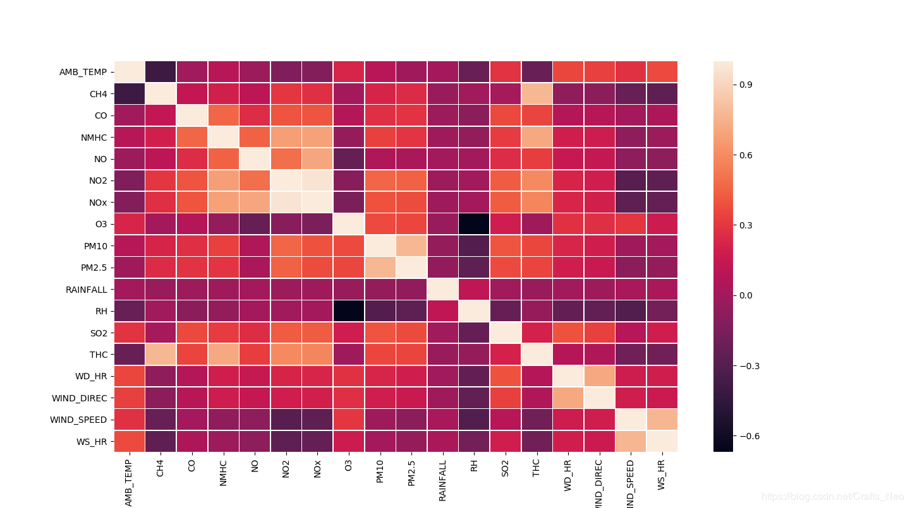
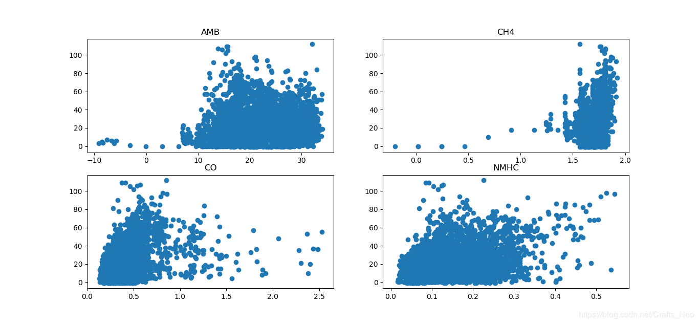
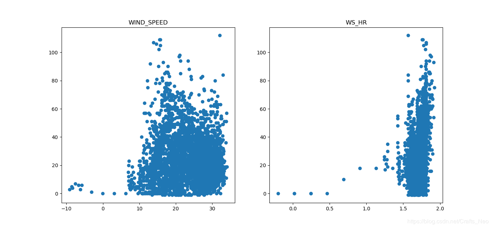

## Pandas的数据结构

```python
import pandas as pd
```

Pandas有两个最主要也是最重要的数据结构： **Series** 和 **DataFrame**

> ### Series

Series是一种类似于一维数组的 **对象**，由一组数据（各种NumPy数据类型）以及一组与之对应的索引（数据标签）组成。

- 类似一维数组的对象
- 由数据和索引组成
  - 索引(index)在左，数据(values)在右
  - 索引是自动创建的



#### 1. 通过list构建Series

> ser_obj = pd.Series(range(10))

示例代码：

```python
# 通过list构建Series
ser_obj = pd.Series(range(10, 20))
print(ser_obj.head(3))

print(ser_obj)

print(type(ser_obj))
```

运行结果：

```python
0    10
1    11
2    12
dtype: int64

0    10
1    11
2    12
3    13
4    14
5    15
6    16
7    17
8    18
9    19
dtype: int64

<class 'pandas.core.series.Series'>
```

#### 2. 获取数据和索引

> ser_obj.index 和 ser_obj.values

示例代码：

```python
# 获取数据
print(ser_obj.values)

# 获取索引
print(ser_obj.index)
```

运行结果：

```python
[10 11 12 13 14 15 16 17 18 19]
RangeIndex(start=0, stop=10, step=1)
```

#### 3. 通过索引获取数据

> ser_obj[idx]

示例代码：

```python
#通过索引获取数据
print(ser_obj[0])
print(ser_obj[8])
```

运行结果：

```python
10
18
```

#### 4. 索引与数据的对应关系不被运算结果影响

示例代码：

```python
# 索引与数据的对应关系不被运算结果影响
print(ser_obj * 2)
print(ser_obj > 15)
```

运行结果：

```python
0    20
1    22
2    24
3    26
4    28
5    30
6    32
7    34
8    36
9    38
dtype: int64

0    False
1    False
2    False
3    False
4    False
5    False
6     True
7     True
8     True
9     True
dtype: bool
```

#### 5. 通过dict构建Series

示例代码：

```python
# 通过dict构建Series
year_data = {2001: 17.8, 2002: 20.1, 2003: 16.5}
ser_obj2 = pd.Series(year_data)
print(ser_obj2.head())
print(ser_obj2.index)
```

运行结果：

```python
2001    17.8
2002    20.1
2003    16.5
dtype: float64
Int64Index([2001, 2002, 2003], dtype='int64')
```

#### name属性

> 对象名：ser_obj.name
>
> 对象索引名：ser_obj.index.name

示例代码：

```python
# name属性
ser_obj2.name = 'temp'
ser_obj2.index.name = 'year'
print(ser_obj2.head())
```

运行结果：

```python
year
2001    17.8
2002    20.1
2003    16.5
Name: temp, dtype: float64
```

------

------

> ### DataFrame

DataFrame是一个表格型的数据结构，它含有一组有序的列，每列可以是不同类型的值。DataFrame既有行索引也有列索引，它可以被看做是由Series组成的字典（共用同一个索引），数据是以二维结构存放的。

- 类似多维数组/表格数据 (如，excel, R中的data.frame)
- 每列数据可以是不同的类型
- 索引包括列索引和行索引



#### 1. 通过ndarray构建DataFrame

示例代码：

```python
import numpy as np

# 通过ndarray构建DataFrame
array = np.random.randn(5,4)
print(array)

df_obj = pd.DataFrame(array)
print(df_obj.head())
```

运行结果：

```python
[[ 0.83500594 -1.49290138 -0.53120106 -0.11313932]
 [ 0.64629762 -0.36779941  0.08011084  0.60080495]
 [-1.23458522  0.33409674 -0.58778195 -0.73610573]
 [-1.47651414  0.99400187  0.21001995 -0.90515656]
 [ 0.56669419  1.38238348 -0.49099007  1.94484598]]

          0         1         2         3
0  0.835006 -1.492901 -0.531201 -0.113139
1  0.646298 -0.367799  0.080111  0.600805
2 -1.234585  0.334097 -0.587782 -0.736106
3 -1.476514  0.994002  0.210020 -0.905157
4  0.566694  1.382383 -0.490990  1.944846
```

#### 2. 通过dict构建DataFrame

示例代码：

```python
# 通过dict构建DataFrame
dict_data = {'A': 1, 
             'B': pd.Timestamp('20170426'),
             'C': pd.Series(1, index=list(range(4)),dtype='float32'),
             'D': np.array([3] * 4,dtype='int32'),
             'E': ["Python","Java","C++","C"],
             'F': 'ITCast' }
#print dict_data
df_obj2 = pd.DataFrame(dict_data)
print(df_obj2)
```

运行结果：

```python
   A          B    C  D       E       F
0  1 2017-04-26  1.0  3  Python  ITCast
1  1 2017-04-26  1.0  3    Java  ITCast
2  1 2017-04-26  1.0  3     C++  ITCast
3  1 2017-04-26  1.0  3       C  ITCast
```

#### 3. 通过列索引获取列数据（Series类型）

> df_obj[col_idx] 或 df_obj.col_idx

示例代码：

```python
# 通过列索引获取列数据
print(df_obj2['A'])
print(type(df_obj2['A']))

print(df_obj2.A)
```

运行结果：

```python
0    1.0
1    1.0
2    1.0
3    1.0
Name: A, dtype: float64
<class 'pandas.core.series.Series'>
0    1.0
1    1.0
2    1.0
3    1.0
Name: A, dtype: float64
```

#### 4. 增加列数据

> df_obj[new_col_idx] = data
>
> 类似Python的 dict添加key-value

示例代码：

```python
# 增加列
df_obj2['G'] = df_obj2['D'] + 4
print(df_obj2.head())
```

运行结果：

```python
     A          B    C  D       E       F  G
0  1.0 2017-01-02  1.0  3  Python  ITCast  7
1  1.0 2017-01-02  1.0  3    Java  ITCast  7
2  1.0 2017-01-02  1.0  3     C++  ITCast  7
3  1.0 2017-01-02  1.0  3       C  ITCast  7
```

#### 5. 删除列

> del df_obj[col_idx]

示例代码：

```python
# 删除列
del(df_obj2['G'] )
print(df_obj2.head())
```

运行结果：

```python
     A          B    C  D       E       F
0  1.0 2017-01-02  1.0  3  Python  ITCast
1  1.0 2017-01-02  1.0  3    Java  ITCast
2  1.0 2017-01-02  1.0  3     C++  ITCast
3  1.0 2017-01-02  1.0  3       C  ITCast
```

# Pandas的索引操作

> ### 索引对象Index

#### 1. Series和DataFrame中的索引都是Index对象

示例代码：

```python
print(type(ser_obj.index))
print(type(df_obj2.index))

print(df_obj2.index)
```

运行结果：

```python
<class 'pandas.indexes.range.RangeIndex'>
<class 'pandas.indexes.numeric.Int64Index'>
Int64Index([0, 1, 2, 3], dtype='int64')
```

#### 2. 索引对象不可变，保证了数据的安全

示例代码：

```python
# 索引对象不可变
df_obj2.index[0] = 2
```

运行结果：

```python
---------------------------------------------------------------------------
TypeError                                 Traceback (most recent call last)
<ipython-input-23-7f40a356d7d1> in <module>()
      1 # 索引对象不可变
----> 2 df_obj2.index[0] = 2

/Users/Power/anaconda/lib/python3.6/site-packages/pandas/indexes/base.py in __setitem__(self, key, value)
   1402 
   1403     def __setitem__(self, key, value):
-> 1404         raise TypeError("Index does not support mutable operations")
   1405 
   1406     def __getitem__(self, key):

TypeError: Index does not support mutable operations
```

#### 常见的Index种类

- Index，索引
- Int64Index，整数索引
- MultiIndex，层级索引
- DatetimeIndex，时间戳类型

> ### Series索引

#### 1. index 指定行索引名

示例代码：

```python
ser_obj = pd.Series(range(5), index = ['a', 'b', 'c', 'd', 'e'])
print(ser_obj.head())
```

运行结果：

```python
a    0
b    1
c    2
d    3
e    4
dtype: int64
```

#### 2. 行索引

> ser_obj[‘label’], ser_obj[pos]

示例代码：

```python
# 行索引
print(ser_obj['b'])
print(ser_obj[2])
```

运行结果：

```python
1
2
```

#### 3. 切片索引

> ser_obj[2:4], ser_obj[‘label1’: ’label3’]
>
> 注意，按索引名切片操作时，是包含终止索引的。

示例代码：

```python
# 切片索引
print(ser_obj[1:3])
print(ser_obj['b':'d'])
```

运行结果：

```python
b    1
c    2
dtype: int64
b    1
c    2
d    3
dtype: int64
```

#### 4. 不连续索引

> ser_obj[[‘label1’, ’label2’, ‘label3’]]

示例代码：

```python
# 不连续索引
print(ser_obj[[0, 2, 4]])
print(ser_obj[['a', 'e']])
```

运行结果：

```python
a    0
c    2
e    4
dtype: int64
a    0
e    4
dtype: int64
```

#### 5. 布尔索引

示例代码：

```python
# 布尔索引
ser_bool = ser_obj > 2
print(ser_bool)
print(ser_obj[ser_bool])

print(ser_obj[ser_obj > 2])
```

运行结果：

```python
a    False
b    False
c    False
d     True
e     True
dtype: bool
d    3
e    4
dtype: int64
d    3
e    4
dtype: int64
```

### DataFrame索引

#### 1. columns 指定列索引名

示例代码：

```python
import numpy as np

df_obj = pd.DataFrame(np.random.randn(5,4), columns = ['a', 'b', 'c', 'd'])
print(df_obj.head())
```

运行结果：

```python
          a         b         c         d
0 -0.241678  0.621589  0.843546 -0.383105
1 -0.526918 -0.485325  1.124420 -0.653144
2 -1.074163  0.939324 -0.309822 -0.209149
3 -0.716816  1.844654 -2.123637 -1.323484
4  0.368212 -0.910324  0.064703  0.486016
```


#### 2. 列索引

> df_obj[[‘label’]]

示例代码：

```python
# 列索引
print(df_obj['a']) # 返回Series类型
print(df_obj[[0]]) # 返回DataFrame类型
print(type(df_obj[[0]])) # 返回DataFrame类型
```

运行结果：

```python
0   -0.241678
1   -0.526918
2   -1.074163
3   -0.716816
4    0.368212
Name: a, dtype: float64
<class 'pandas.core.frame.DataFrame'>
```

#### 3. 不连续索引

> df_obj[[‘label1’, ‘label2’]]

示例代码：

```python
# 不连续索引
print(df_obj[['a','c']])
print(df_obj[[1, 3]])
```

运行结果：

```python
          a         c
0 -0.241678  0.843546
1 -0.526918  1.124420
2 -1.074163 -0.309822
3 -0.716816 -2.123637
4  0.368212  0.064703
          b         d
0  0.621589 -0.383105
1 -0.485325 -0.653144
2  0.939324 -0.209149
3  1.844654 -1.323484
4 -0.910324  0.486016
```

> ### 高级索引：标签、位置和混合

Pandas的高级索引有3种

#### 1. loc 标签索引

> DataFrame 不能直接切片，可以通过loc来做切片
>
> loc是基于标签名的索引，也就是我们自定义的索引名

示例代码：

```python
# 标签索引 loc
# Series
print(ser_obj['b':'d'])
print(ser_obj.loc['b':'d'])

# DataFrame
print(df_obj['a'])

# 第一个参数索引行，第二个参数是列
print(df_obj.loc[0:2, 'a'])
```

运行结果：

```python
b    1
c    2
d    3
dtype: int64
b    1
c    2
d    3
dtype: int64

0   -0.241678
1   -0.526918
2   -1.074163
3   -0.716816
4    0.368212
Name: a, dtype: float64
0   -0.241678
1   -0.526918
2   -1.074163
Name: a, dtype: float64
```

#### 2. iloc 位置索引

> 作用和loc一样，不过是基于索引编号来索引

示例代码：

```python
# 整型位置索引 iloc
# Series
print(ser_obj[1:3])
print(ser_obj.iloc[1:3])

# DataFrame
print(df_obj.iloc[0:2, 0]) # 注意和df_obj.loc[0:2, 'a']的区别
```

运行结果：

```python
b    1
c    2
dtype: int64
b    1
c    2
dtype: int64

0   -0.241678
1   -0.526918
Name: a, dtype: float64
```

#### 3. ix 标签与位置混合索引

> ix是以上二者的综合，既可以使用索引编号，又可以使用自定义索引，要视情况不同来使用，
>
> 如果索引既有数字又有英文，那么这种方式是不建议使用的，容易导致定位的混乱。

示例代码：

```python
# 混合索引 ix
# Series
print(ser_obj.ix[1:3])
print(ser_obj.ix['b':'c'])

# DataFrame
print(df_obj.loc[0:2, 'a'])
print(df_obj.ix[0:2, 0])
```

运行结果：

```python
b    1
c    2
dtype: int64
b    1
c    2
dtype: int64

0   -0.241678
1   -0.526918
2   -1.074163
Name: a, dtype: float64
```

#### 注意

> DataFrame索引操作，可将其看作ndarray的索引操作
>
> 标签的切片索引是包含末尾位置的

# Pandas的对齐运算

是数据清洗的重要过程，可以按索引对齐进行运算，如果没对齐的位置则补NaN，最后也可以填充NaN

> ### Series的对齐运算

#### 1. Series 按行、索引对齐

示例代码：

```python
s1 = pd.Series(range(10, 20), index = range(10))
s2 = pd.Series(range(20, 25), index = range(5))

print('s1: ' )
print(s1)

print('') 

print('s2: ')
print(s2)
```

运行结果：

```python
s1: 
0    10
1    11
2    12
3    13
4    14
5    15
6    16
7    17
8    18
9    19
dtype: int64

s2: 
0    20
1    21
2    22
3    23
4    24
dtype: int64
```

#### 2. Series的对齐运算

示例代码：

```python
# Series 对齐运算
s1 + s2
```

运行结果：

```python
0    30.0
1    32.0
2    34.0
3    36.0
4    38.0
5     NaN
6     NaN
7     NaN
8     NaN
9     NaN
dtype: float64
```

> ### DataFrame的对齐运算

#### 1. DataFrame按行、列索引对齐

示例代码：

```python
df1 = pd.DataFrame(np.ones((2,2)), columns = ['a', 'b'])
df2 = pd.DataFrame(np.ones((3,3)), columns = ['a', 'b', 'c'])

print('df1: ')
print(df1)

print('') 
print('df2: ')
print(df2)
```

运行结果：

```python
df1: 
     a    b
0  1.0  1.0
1  1.0  1.0

df2: 
     a    b    c
0  1.0  1.0  1.0
1  1.0  1.0  1.0
2  1.0  1.0  1.0
```

#### 2. DataFrame的对齐运算

示例代码：

```python
# DataFrame对齐操作
df1 + df2
```

运行结果：

```python
     a    b   c
0  2.0  2.0 NaN
1  2.0  2.0 NaN
2  NaN  NaN NaN
```

> ### 填充未对齐的数据进行运算

#### 1. fill_value

> 使用`add`, `sub`, `div`, `mul`的同时，
>
> 通过`fill_value`指定填充值，未对齐的数据将和填充值做运算

示例代码：

```python
print(s1)
print(s2)
s1.add(s2, fill_value = -1)

print(df1)
print(df2)
df1.sub(df2, fill_value = 2.)
```

运行结果：

```python
# print(s1)
0    10
1    11
2    12
3    13
4    14
5    15
6    16
7    17
8    18
9    19
dtype: int64

# print(s2)
0    20
1    21
2    22
3    23
4    24
dtype: int64

# s1.add(s2, fill_value = -1)
0    30.0
1    32.0
2    34.0
3    36.0
4    38.0
5    14.0
6    15.0
7    16.0
8    17.0
9    18.0
dtype: float64


# print(df1)
     a    b
0  1.0  1.0
1  1.0  1.0

# print(df2)
     a    b    c
0  1.0  1.0  1.0
1  1.0  1.0  1.0
2  1.0  1.0  1.0


# df1.sub(df2, fill_value = 2.)
     a    b    c
0  0.0  0.0  1.0
1  0.0  0.0  1.0
2  1.0  1.0  1.0
```

# Pandas的函数应用

> ### apply 和 applymap

#### 1. 可直接使用NumPy的函数

示例代码：

```python
# Numpy ufunc 函数
df = pd.DataFrame(np.random.randn(5,4) - 1)
print(df)

print(np.abs(df))
```

运行结果：

```python
          0         1         2         3
0 -0.062413  0.844813 -1.853721 -1.980717
1 -0.539628 -1.975173 -0.856597 -2.612406
2 -1.277081 -1.088457 -0.152189  0.530325
3 -1.356578 -1.996441  0.368822 -2.211478
4 -0.562777  0.518648 -2.007223  0.059411

          0         1         2         3
0  0.062413  0.844813  1.853721  1.980717
1  0.539628  1.975173  0.856597  2.612406
2  1.277081  1.088457  0.152189  0.530325
3  1.356578  1.996441  0.368822  2.211478
4  0.562777  0.518648  2.007223  0.059411
```

#### 2. 通过apply将函数应用到列或行上

示例代码：

```python
# 使用apply应用行或列数据
#f = lambda x : x.max()
print(df.apply(lambda x : x.max()))
```

运行结果：

```python
0   -0.062413
1    0.844813
2    0.368822
3    0.530325
dtype: float64
```

> 注意指定轴的方向，默认axis=0，方向是列

示例代码：

```python
# 指定轴方向，axis=1，方向是行
print(df.apply(lambda x : x.max(), axis=1))
```

运行结果：

```python
0    0.844813
1   -0.539628
2    0.530325
3    0.368822
4    0.518648
dtype: float64
```

#### 3. 通过applymap将函数应用到每个数据上

示例代码：

```python
# 使用applymap应用到每个数据
f2 = lambda x : '%.2f' % x
print(df.applymap(f2))
```

运行结果：

```python
       0      1      2      3
0  -0.06   0.84  -1.85  -1.98
1  -0.54  -1.98  -0.86  -2.61
2  -1.28  -1.09  -0.15   0.53
3  -1.36  -2.00   0.37  -2.21
4  -0.56   0.52  -2.01   0.06
```

> ### 排序

#### 1. 索引排序

> sort_index()
>
> 排序默认使用升序排序，ascending=False 为降序排序

示例代码：

```python
# Series
s4 = pd.Series(range(10, 15), index = np.random.randint(5, size=5))
print(s4)

# 索引排序
s4.sort_index() # 0 0 1 3 3
```

运行结果：

```python
0    10
3    11
1    12
3    13
0    14
dtype: int64

0    10
0    14
1    12
3    11
3    13
dtype: int64
```

> 对DataFrame操作时注意轴方向

示例代码：

```python
# DataFrame
df4 = pd.DataFrame(np.random.randn(3, 5), 
                   index=np.random.randint(3, size=3),
                   columns=np.random.randint(5, size=5))
print(df4)

df4_isort = df4.sort_index(axis=1, ascending=False)
print(df4_isort) # 4 2 1 1 0
```

运行结果：

```python
          1         4         0         1         2
2 -0.416686 -0.161256  0.088802 -0.004294  1.164138
1 -0.671914  0.531256  0.303222 -0.509493 -0.342573
1  1.988321 -0.466987  2.787891 -1.105912  0.889082

          4         2         1         1         0
2 -0.161256  1.164138 -0.416686 -0.004294  0.088802
1  0.531256 -0.342573 -0.671914 -0.509493  0.303222
1 -0.466987  0.889082  1.988321 -1.105912  2.787891
```

#### 2. 按值排序

> sort_values(by='column name')
>
> 根据某个唯一的列名进行排序，如果有其他相同列名则报错。

示例代码：

```python
# 按值排序
df4_vsort = df4.sort_values(by=0, ascending=False)
print(df4_vsort)
```

运行结果：

```python
          1         4         0         1         2
1  1.988321 -0.466987  2.787891 -1.105912  0.889082
1 -0.671914  0.531256  0.303222 -0.509493 -0.342573
2 -0.416686 -0.161256  0.088802 -0.004294  1.164138
```

> ### 处理缺失数据

示例代码：

```python
df_data = pd.DataFrame([np.random.randn(3), [1., 2., np.nan],
                       [np.nan, 4., np.nan], [1., 2., 3.]])
print(df_data.head())
```

运行结果：

```python
          0         1         2
0 -0.281885 -0.786572  0.487126
1  1.000000  2.000000       NaN
2       NaN  4.000000       NaN
3  1.000000  2.000000  3.000000
```

#### 1. 判断是否存在缺失值：isnull()

示例代码：

```python
# isnull
print(df_data.isnull())
```

运行结果：

```python
       0      1      2
0  False  False  False
1  False  False   True
2   True  False   True
3  False  False  False
```

#### 2. 丢弃缺失数据：dropna()

> 根据axis轴方向，丢弃包含NaN的行或列。 示例代码：

```python
# dropna
print(df_data.dropna())

print(df_data.dropna(axis=1))
```

运行结果：

```python
          0         1         2
0 -0.281885 -0.786572  0.487126
3  1.000000  2.000000  3.000000

          1
0 -0.786572
1  2.000000
2  4.000000
3  2.000000
```

#### 3. 填充缺失数据：fillna()

示例代码：

```python
# fillna
print(df_data.fillna(-100.))
```

运行结果：

```python
            0         1           2
0   -0.281885 -0.786572    0.487126
1    1.000000  2.000000 -100.000000
2 -100.000000  4.000000 -100.000000
3    1.000000  2.000000    3.000000
```

# 层级索引（hierarchical indexing）

> 下面创建一个Series， 在输入索引Index时，输入了由两个子list组成的list，第一个子list是外层索引，第二个list是内层索引。

示例代码：

```python
import pandas as pd
import numpy as np

ser_obj = pd.Series(np.random.randn(12),index=[
                ['a', 'a', 'a', 'b', 'b', 'b', 'c', 'c', 'c', 'd', 'd', 'd'],
                [0, 1, 2, 0, 1, 2, 0, 1, 2, 0, 1, 2]
            ])
print(ser_obj)
```

运行结果：

```python
a  0    0.099174
   1   -0.310414
   2   -0.558047
b  0    1.742445
   1    1.152924
   2   -0.725332
c  0   -0.150638
   1    0.251660
   2    0.063387
d  0    1.080605
   1    0.567547
   2   -0.154148
dtype: float64
```

> ### MultiIndex索引对象

- 打印这个Series的索引类型，显示是MultiIndex
- 直接将索引打印出来，可以看到有lavels,和labels两个信息。lavels表示两个层级中分别有那些标签，labels是每个位置分别是什么标签。

示例代码：

```python
print(type(ser_obj.index))
print(ser_obj.index)
```

运行结果：

```python
<class 'pandas.indexes.multi.MultiIndex'>
MultiIndex(levels=[['a', 'b', 'c', 'd'], [0, 1, 2]],
           labels=[[0, 0, 0, 1, 1, 1, 2, 2, 2, 3, 3, 3], [0, 1, 2, 0, 1, 2, 0, 1, 2, 0, 1, 2]])
```

> ### 选取子集

- 根据索引获取数据。因为现在有两层索引，当通过外层索引获取数据的时候，可以直接利用外层索引的标签来获取。
- 当要通过内层索引获取数据的时候，在list中传入两个元素，前者是表示要选取的外层索引，后者表示要选取的内层索引。

#### 1. 外层选取：

> ser_obj['outer_label']

示例代码：

```python
# 外层选取
print(ser_obj['c'])
```

运行结果：

```python
0   -1.362096
1    1.558091
2   -0.452313
dtype: float64
```

#### 2. 内层选取：

> ser_obj[:, 'inner_label']

示例代码：

```python
# 内层选取
print(ser_obj[:, 2])
```

运行结果：

```python
a    0.826662
b    0.015426
c   -0.452313
d   -0.051063
dtype: float64
```

**常用于分组操作、透视表的生成等**

> ### 交换分层顺序

#### 1. swaplevel()

> .swaplevel( )交换内层与外层索引。

示例代码：

```python
print(ser_obj.swaplevel())
```

运行结果：

```python
0  a    0.099174
1  a   -0.310414
2  a   -0.558047
0  b    1.742445
1  b    1.152924
2  b   -0.725332
0  c   -0.150638
1  c    0.251660
2  c    0.063387
0  d    1.080605
1  d    0.567547
2  d   -0.154148
dtype: float64
```

> ### 交换并排序分层

#### sortlevel()

> .sortlevel( )先对外层索引进行排序，再对内层索引进行排序，默认是升序。

示例代码：

```python
# 交换并排序分层
print(ser_obj.swaplevel().sortlevel())
```

运行结果：

```python
0  a    0.099174
   b    1.742445
   c   -0.150638
   d    1.080605
1  a   -0.310414
   b    1.152924
   c    0.251660
   d    0.567547
2  a   -0.558047
   b   -0.725332
   c    0.063387
   d   -0.154148
dtype: float64
```

# Pandas统计计算和描述

示例代码：

```python
import numpy as np
import pandas as pd

df_obj = pd.DataFrame(np.random.randn(5,4), columns = ['a', 'b', 'c', 'd'])
print(df_obj)
```

运行结果：

```python
          a         b         c         d
0  1.469682  1.948965  1.373124 -0.564129
1 -1.466670 -0.494591  0.467787 -2.007771
2  1.368750  0.532142  0.487862 -1.130825
3 -0.758540 -0.479684  1.239135  1.073077
4 -0.007470  0.997034  2.669219  0.742070
```

> ### 常用的统计计算

#### sum, mean, max, min…

> axis=0 按列统计，axis=1按行统计
>
> skipna  排除缺失值， 默认为True

示例代码：

```python
df_obj.sum()

df_obj.max()

df_obj.min(axis=1, skipna=False)
```

运行结果：

```python
a    0.605751
b    2.503866
c    6.237127
d   -1.887578
dtype: float64

a    1.469682
b    1.948965
c    2.669219
d    1.073077
dtype: float64

0   -0.564129
1   -2.007771
2   -1.130825
3   -0.758540
4   -0.007470
dtype: float64
```

> ### 常用的统计描述

#### describe 产生多个统计数据

示例代码：

```python
print(df_obj.describe())
```

运行结果：

```python
              a         b         c         d
count  5.000000  5.000000  5.000000  5.000000
mean   0.180305  0.106488  0.244978  0.178046
std    0.641945  0.454340  1.064356  1.144416
min   -0.677175 -0.490278 -1.164928 -1.574556
25%   -0.064069 -0.182920 -0.464013 -0.089962
50%    0.231722  0.127846  0.355859  0.190482
75%    0.318854  0.463377  1.169750  0.983663
max    1.092195  0.614413  1.328220  1.380601
```

> ### 常用的统计描述方法：

 

# Pandas分组与聚合

> ### 分组 (groupby)

- 对数据集进行分组，然后对每组进行统计分析
- SQL能够对数据进行过滤，分组聚合
- pandas能利用groupby进行更加复杂的分组运算
- 分组运算过程：split->apply->combine
  1. 拆分：进行分组的根据
  2. 应用：每个分组运行的计算规则
  3. 合并：把每个分组的计算结果合并起来


示例代码：

```python
import pandas as pd
import numpy as np

dict_obj = {'key1' : ['a', 'b', 'a', 'b', 
                      'a', 'b', 'a', 'a'],
            'key2' : ['one', 'one', 'two', 'three',
                      'two', 'two', 'one', 'three'],
            'data1': np.random.randn(8),
            'data2': np.random.randn(8)}
df_obj = pd.DataFrame(dict_obj)
print(df_obj)
```

运行结果：

```python
      data1     data2 key1   key2
0  0.974685 -0.672494    a    one
1 -0.214324  0.758372    b    one
2  1.508838  0.392787    a    two
3  0.522911  0.630814    b  three
4  1.347359 -0.177858    a    two
5 -0.264616  1.017155    b    two
6 -0.624708  0.450885    a    one
7 -1.019229 -1.143825    a  three
```

### 一、GroupBy对象：DataFrameGroupBy，SeriesGroupBy

#### 1. 分组操作

> groupby()进行分组，GroupBy对象没有进行实际运算，只是包含分组的中间数据
>
> 按列名分组：obj.groupby(‘label’)

示例代码：

```python
# dataframe根据key1进行分组
print(type(df_obj.groupby('key1')))

# dataframe的 data1 列根据 key1 进行分组
print(type(df_obj['data1'].groupby(df_obj['key1'])))
```

运行结果：

```python
<class 'pandas.core.groupby.DataFrameGroupBy'>
<class 'pandas.core.groupby.SeriesGroupBy'>
```

#### 2. 分组运算

> 对GroupBy对象进行分组运算/多重分组运算，如mean()
>
> 非数值数据不进行分组运算

示例代码：

```python
# 分组运算
grouped1 = df_obj.groupby('key1')
print(grouped1.mean())

grouped2 = df_obj['data1'].groupby(df_obj['key1'])
print(grouped2.mean())
```

运行结果：

```python
         data1     data2
key1                    
a     0.437389 -0.230101
b     0.014657  0.802114
key1
a    0.437389
b    0.014657
Name: data1, dtype: float64
```

> size() 返回每个分组的元素个数

示例代码：

```python
# size
print(grouped1.size())
print(grouped2.size())
```

运行结果：

```python
key1
a    5
b    3
dtype: int64
key1
a    5
b    3
dtype: int64
```

#### 3. 按自定义的key分组

> obj.groupby(self_def_key)
>
> 自定义的key可为列表或多层列表
>
> obj.groupby([‘label1’, ‘label2’])->多层dataframe

示例代码：

```python
# 按自定义key分组，列表
self_def_key = [0, 1, 2, 3, 3, 4, 5, 7]
print(df_obj.groupby(self_def_key).size())

# 按自定义key分组，多层列表
print(df_obj.groupby([df_obj['key1'], df_obj['key2']]).size())

# 按多个列多层分组
grouped2 = df_obj.groupby(['key1', 'key2'])
print(grouped2.size())

# 多层分组按key的顺序进行
grouped3 = df_obj.groupby(['key2', 'key1'])
print(grouped3.mean())
# unstack可以将多层索引的结果转换成单层的dataframe
print(grouped3.mean().unstack())
```

运行结果：

```python
0    1
1    1
2    1
3    2
4    1
5    1
7    1
dtype: int64

key1  key2 
a     one      2
      three    1
      two      2
b     one      1
      three    1
      two      1
dtype: int64


key1  key2 
a     one      2
      three    1
      two      2
b     one      1
      three    1
      two      1
dtype: int64


               data1     data2
key2  key1                    
one   a     0.174988 -0.110804
      b    -0.214324  0.758372
three a    -1.019229 -1.143825
      b     0.522911  0.630814
two   a     1.428099  0.107465
      b    -0.264616  1.017155

          data1               data2          
key1          a         b         a         b
key2                                         
one    0.174988 -0.214324 -0.110804  0.758372
three -1.019229  0.522911 -1.143825  0.630814
two    1.428099 -0.264616  0.107465  1.017155
```

### 二、GroupBy对象支持迭代操作

> 每次迭代返回一个元组 (group_name, group_data)
>
> 可用于分组数据的具体运算

#### 1. 单层分组

示例代码：

```python
# 单层分组，根据key1
for group_name, group_data in grouped1:
    print(group_name)
    print(group_data)
```

运行结果：

```python
a
      data1     data2 key1   key2
0  0.974685 -0.672494    a    one
2  1.508838  0.392787    a    two
4  1.347359 -0.177858    a    two
6 -0.624708  0.450885    a    one
7 -1.019229 -1.143825    a  three

b
      data1     data2 key1   key2
1 -0.214324  0.758372    b    one
3  0.522911  0.630814    b  three
5 -0.264616  1.017155    b    two
```

#### 2. 多层分组

示例代码：

```python
# 多层分组，根据key1 和 key2
for group_name, group_data in grouped2:
    print(group_name)
    print(group_data)
```

运行结果：

```python
('a', 'one')
      data1     data2 key1 key2
0  0.974685 -0.672494    a  one
6 -0.624708  0.450885    a  one

('a', 'three')
      data1     data2 key1   key2
7 -1.019229 -1.143825    a  three

('a', 'two')
      data1     data2 key1 key2
2  1.508838  0.392787    a  two
4  1.347359 -0.177858    a  two

('b', 'one')
      data1     data2 key1 key2
1 -0.214324  0.758372    b  one

('b', 'three')
      data1     data2 key1   key2
3  0.522911  0.630814    b  three

('b', 'two')
      data1     data2 key1 key2
5 -0.264616  1.017155    b  two
```

#### 三、GroupBy对象可以转换成列表或字典

示例代码：

```python
# GroupBy对象转换list
print(list(grouped1))

# GroupBy对象转换dict
print(dict(list(grouped1)))
```

运行结果：

```python
[('a',       data1     data2 key1   key2
0  0.974685 -0.672494    a    one
2  1.508838  0.392787    a    two
4  1.347359 -0.177858    a    two
6 -0.624708  0.450885    a    one
7 -1.019229 -1.143825    a  three), 
('b',       data1     data2 key1   key2
1 -0.214324  0.758372    b    one
3  0.522911  0.630814    b  three
5 -0.264616  1.017155    b    two)]

{'a':       data1     data2 key1   key2
0  0.974685 -0.672494    a    one
2  1.508838  0.392787    a    two
4  1.347359 -0.177858    a    two
6 -0.624708  0.450885    a    one
7 -1.019229 -1.143825    a  three, 
'b':       data1     data2 key1   key2
1 -0.214324  0.758372    b    one
3  0.522911  0.630814    b  three
5 -0.264616  1.017155    b    two}
```

#### 1. 按列分组、按数据类型分组

示例代码：

```python
# 按列分组
print(df_obj.dtypes)

# 按数据类型分组
print(df_obj.groupby(df_obj.dtypes, axis=1).size())
print(df_obj.groupby(df_obj.dtypes, axis=1).sum())
```

运行结果：

```python
data1    float64
data2    float64
key1      object
key2      object
dtype: object

float64    2
object     2
dtype: int64

    float64  object
0  0.302191    a one
1  0.544048    b one
2  1.901626    a two
3  1.153725  b three
4  1.169501    a two
5  0.752539    b two
6 -0.173823    a one
7 -2.163054  a three
```

#### 2. 其他分组方法

示例代码：

```python
df_obj2 = pd.DataFrame(np.random.randint(1, 10, (5,5)),
                       columns=['a', 'b', 'c', 'd', 'e'],
                       index=['A', 'B', 'C', 'D', 'E'])
df_obj2.ix[1, 1:4] = np.NaN
print(df_obj2)
```

运行结果：

```python
   a    b    c    d  e
A  7  2.0  4.0  5.0  8
B  4  NaN  NaN  NaN  1
C  3  2.0  5.0  4.0  6
D  3  1.0  9.0  7.0  3
E  6  1.0  6.0  8.0  1
```

#### 3. 通过字典分组

示例代码：

```python
# 通过字典分组
mapping_dict = {'a':'Python', 'b':'Python', 'c':'Java', 'd':'C', 'e':'Java'}
print(df_obj2.groupby(mapping_dict, axis=1).size())
print(df_obj2.groupby(mapping_dict, axis=1).count()) # 非NaN的个数
print(df_obj2.groupby(mapping_dict, axis=1).sum())
```

运行结果：

```python
C         1
Java      2
Python    2
dtype: int64

   C  Java  Python
A  1     2       2
B  0     1       1
C  1     2       2
D  1     2       2
E  1     2       2

     C  Java  Python
A  5.0  12.0     9.0
B  NaN   1.0     4.0
C  4.0  11.0     5.0
D  7.0  12.0     4.0
E  8.0   7.0     7.0
```

#### 4. 通过函数分组，函数传入的参数为行索引或列索引

示例代码：

```python
# 通过函数分组
df_obj3 = pd.DataFrame(np.random.randint(1, 10, (5,5)),
                       columns=['a', 'b', 'c', 'd', 'e'],
                       index=['AA', 'BBB', 'CC', 'D', 'EE'])
#df_obj3

def group_key(idx):
    """
        idx 为列索引或行索引
    """
    #return idx
    return len(idx)

print(df_obj3.groupby(group_key).size())

# 以上自定义函数等价于
#df_obj3.groupby(len).size()
```

运行结果：

```python
1    1
2    3
3    1
dtype: int64
```

#### 5. 通过索引级别分组

示例代码：

```python
# 通过索引级别分组
columns = pd.MultiIndex.from_arrays([['Python', 'Java', 'Python', 'Java', 'Python'],
                                     ['A', 'A', 'B', 'C', 'B']], names=['language', 'index'])
df_obj4 = pd.DataFrame(np.random.randint(1, 10, (5, 5)), columns=columns)
print(df_obj4)

# 根据language进行分组
print(df_obj4.groupby(level='language', axis=1).sum())
# 根据index进行分组
print(df_obj4.groupby(level='index', axis=1).sum())
```

运行结果：

```python
language Python Java Python Java Python
index         A    A      B    C      B
0             2    7      8    4      3
1             5    2      6    1      2
2             6    4      4    5      2
3             4    7      4    3      1
4             7    4      3    4      8

language  Java  Python
0           11      13
1            3      13
2            9      12
3           10       9
4            8      18

index   A   B  C
0       9  11  4
1       7   8  1
2      10   6  5
3      11   5  3
4      11  11  4
```

> ### 聚合 (aggregation)

- 数组产生标量的过程，如mean()、count()等
- 常用于对分组后的数据进行计算

示例代码：

```python
dict_obj = {'key1' : ['a', 'b', 'a', 'b', 
                      'a', 'b', 'a', 'a'],
            'key2' : ['one', 'one', 'two', 'three',
                      'two', 'two', 'one', 'three'],
            'data1': np.random.randint(1,10, 8),
            'data2': np.random.randint(1,10, 8)}
df_obj5 = pd.DataFrame(dict_obj)
print(df_obj5)
```

运行结果：

```python
   data1  data2 key1   key2
0      3      7    a    one
1      1      5    b    one
2      7      4    a    two
3      2      4    b  three
4      6      4    a    two
5      9      9    b    two
6      3      5    a    one
7      8      4    a  three
```

#### 1. 内置的聚合函数

> sum(), mean(), max(), min(), count(), size(), describe()

示例代码：

```python
print(df_obj5.groupby('key1').sum())
print(df_obj5.groupby('key1').max())
print(df_obj5.groupby('key1').min())
print(df_obj5.groupby('key1').mean())
print(df_obj5.groupby('key1').size())
print(df_obj5.groupby('key1').count())
print(df_obj5.groupby('key1').describe())
```

运行结果：

```python
      data1  data2
key1              
a        27     24
b        12     18

      data1  data2 key2
key1                   
a         8      7  two
b         9      9  two

      data1  data2 key2
key1                   
a         3      4  one
b         1      4  one

      data1  data2
key1              
a       5.4    4.8
b       4.0    6.0

key1
a    5
b    3
dtype: int64

      data1  data2  key2
key1                    
a         5      5     5
b         3      3     3

               data1     data2
key1                          
a    count  5.000000  5.000000
     mean   5.400000  4.800000
     std    2.302173  1.303840
     min    3.000000  4.000000
     25%    3.000000  4.000000
     50%    6.000000  4.000000
     75%    7.000000  5.000000
     max    8.000000  7.000000
b    count  3.000000  3.000000
     mean   4.000000  6.000000
     std    4.358899  2.645751
     min    1.000000  4.000000
     25%    1.500000  4.500000
     50%    2.000000  5.000000
     75%    5.500000  7.000000
     max    9.000000  9.000000
```

#### 2. 可自定义函数，传入agg方法中

> grouped.agg(func)
>
> func的参数为groupby索引对应的记录

示例代码：

```python
# 自定义聚合函数
def peak_range(df):
    """
        返回数值范围
    """
    #print type(df) #参数为索引所对应的记录
    return df.max() - df.min()

print(df_obj5.groupby('key1').agg(peak_range))
print(df_obj.groupby('key1').agg(lambda df : df.max() - df.min()))
```

运行结果：

```python
      data1  data2
key1              
a         5      3
b         8      5

         data1     data2
key1                    
a     2.528067  1.594711
b     0.787527  0.386341
In [25]:
```

#### 3. 应用多个聚合函数

> 同时应用多个函数进行聚合操作，使用函数列表

示例代码：

```python
# 应用多个聚合函数

# 同时应用多个聚合函数
print(df_obj.groupby('key1').agg(['mean', 'std', 'count', peak_range])) # 默认列名为函数名

print(df_obj.groupby('key1').agg(['mean', 'std', 'count', ('range', peak_range)])) # 通过元组提供新的列名
```

运行结果：

```python
         data1                                data2                           
          mean       std count peak_range      mean       std count peak_range
key1                                                                          
a     0.437389  1.174151     5   2.528067 -0.230101  0.686488     5   1.594711
b     0.014657  0.440878     3   0.787527  0.802114  0.196850     3   0.386341

         data1                               data2                          
          mean       std count     range      mean       std count     range
key1                                                                        
a     0.437389  1.174151     5  2.528067 -0.230101  0.686488     5  1.594711
b     0.014657  0.440878     3  0.787527  0.802114  0.196850     3  0.386341
```

#### 4. 对不同的列分别作用不同的聚合函数，使用dict

示例代码：

```python
# 每列作用不同的聚合函数
dict_mapping = {'data1':'mean',
                'data2':'sum'}
print(df_obj.groupby('key1').agg(dict_mapping))

dict_mapping = {'data1':['mean','max'],
                'data2':'sum'}
print(df_obj.groupby('key1').agg(dict_mapping))
```

运行结果：

```python
         data1     data2
key1                    
a     0.437389 -1.150505
b     0.014657  2.406341

         data1               data2
          mean       max       sum
key1                              
a     0.437389  1.508838 -1.150505
b     0.014657  0.522911  2.406341
```

#### 5. 常用的内置聚合函数



> ### 数据的分组运算

示例代码：

```python
import pandas as pd
import numpy as np

dict_obj = {'key1' : ['a', 'b', 'a', 'b', 
                      'a', 'b', 'a', 'a'],
            'key2' : ['one', 'one', 'two', 'three',
                      'two', 'two', 'one', 'three'],
            'data1': np.random.randint(1, 10, 8),
            'data2': np.random.randint(1, 10, 8)}
df_obj = pd.DataFrame(dict_obj)
print(df_obj)

# 按key1分组后，计算data1，data2的统计信息并附加到原始表格中，并添加表头前缀
k1_sum = df_obj.groupby('key1').sum().add_prefix('sum_')
print(k1_sum)
```

运行结果：

```python
   data1  data2 key1   key2
0      5      1    a    one
1      7      8    b    one
2      1      9    a    two
3      2      6    b  three
4      9      8    a    two
5      8      3    b    two
6      3      5    a    one
7      8      3    a  three

      sum_data1  sum_data2
key1                      
a            26         26
b            17         17
```

> 聚合运算后会改变原始数据的形状，
>
> 如何保持原始数据的形状?

#### 1. merge

> 使用merge的外连接，比较复杂

示例代码：

```python
# 方法1，使用merge
k1_sum_merge = pd.merge(df_obj, k1_sum, left_on='key1', right_index=True)
print(k1_sum_merge)
```

运行结果：

```python
   data1  data2 key1   key2  sum_data1  sum_data2
0      5      1    a    one         26         26
2      1      9    a    two         26         26
4      9      8    a    two         26         26
6      3      5    a    one         26         26
7      8      3    a  three         26         26
1      7      8    b    one         17         17
3      2      6    b  three         17         17
5      8      3    b    two         17         17
```

#### 2. transform

> transform的计算结果和原始数据的形状保持一致，
>
> 如：grouped.transform(np.sum)

示例代码：

```python
# 方法2，使用transform
k1_sum_tf = df_obj.groupby('key1').transform(np.sum).add_prefix('sum_')
df_obj[k1_sum_tf.columns] = k1_sum_tf
print(df_obj)
```

运行结果：

```python
   data1  data2 key1   key2 sum_data1 sum_data2           sum_key2
0      5      1    a    one        26        26  onetwotwoonethree
1      7      8    b    one        17        17        onethreetwo
2      1      9    a    two        26        26  onetwotwoonethree
3      2      6    b  three        17        17        onethreetwo
4      9      8    a    two        26        26  onetwotwoonethree
5      8      3    b    two        17        17        onethreetwo
6      3      5    a    one        26        26  onetwotwoonethree
7      8      3    a  three        26        26  onetwotwoonethree
```

> 也可传入自定义函数，

示例代码：

```python
# 自定义函数传入transform
def diff_mean(s):
    """
        返回数据与均值的差值
    """
    return s - s.mean()

print(df_obj.groupby('key1').transform(diff_mean))
```

运行结果：

```python
      data1     data2 sum_data1 sum_data2
0 -0.200000 -4.200000         0         0
1  1.333333  2.333333         0         0
2 -4.200000  3.800000         0         0
3 -3.666667  0.333333         0         0
4  3.800000  2.800000         0         0
5  2.333333 -2.666667         0         0
6 -2.200000 -0.200000         0         0
7  2.800000 -2.200000         0         0
```

> ### groupby.apply(func)
>
> func函数也可以在各分组上分别调用，最后结果通过pd.concat组装到一起（数据合并）

示例代码：

```python
import pandas as pd
import numpy as np

dataset_path = './starcraft.csv'
df_data = pd.read_csv(dataset_path, usecols=['LeagueIndex', 'Age', 'HoursPerWeek', 
                                             'TotalHours', 'APM'])

def top_n(df, n=3, column='APM'):
    """
        返回每个分组按 column 的 top n 数据
    """
    return df.sort_values(by=column, ascending=False)[:n]

print(df_data.groupby('LeagueIndex').apply(top_n))
```

运行结果：

```python
                  LeagueIndex   Age  HoursPerWeek  TotalHours       APM
LeagueIndex                                                            
1           2214            1  20.0          12.0       730.0  172.9530
            2246            1  27.0           8.0       250.0  141.6282
            1753            1  20.0          28.0       100.0  139.6362
2           3062            2  20.0           6.0       100.0  179.6250
            3229            2  16.0          24.0       110.0  156.7380
            1520            2  29.0           6.0       250.0  151.6470
3           1557            3  22.0           6.0       200.0  226.6554
            484             3  19.0          42.0       450.0  220.0692
            2883            3  16.0           8.0       800.0  208.9500
4           2688            4  26.0          24.0       990.0  249.0210
            1759            4  16.0           6.0        75.0  229.9122
            2637            4  23.0          24.0       650.0  227.2272
5           3277            5  18.0          16.0       950.0  372.6426
            93              5  17.0          36.0       720.0  335.4990
            202             5  37.0          14.0       800.0  327.7218
6           734             6  16.0          28.0       730.0  389.8314
            2746            6  16.0          28.0      4000.0  350.4114
            1810            6  21.0          14.0       730.0  323.2506
7           3127            7  23.0          42.0      2000.0  298.7952
            104             7  21.0          24.0      1000.0  286.4538
            1654            7  18.0          98.0       700.0  236.0316
8           3393            8   NaN           NaN         NaN  375.8664
            3373            8   NaN           NaN         NaN  364.8504
            3372            8   NaN           NaN         NaN  355.3518
```

#### 1. 产生层级索引：外层索引是分组名，内层索引是df_obj的行索引

示例代码：

```python
# apply函数接收的参数会传入自定义的函数中
print(df_data.groupby('LeagueIndex').apply(top_n, n=2, column='Age'))
```

运行结果：

```python
                  LeagueIndex   Age  HoursPerWeek  TotalHours       APM
LeagueIndex                                                            
1           3146            1  40.0          12.0       150.0   38.5590
            3040            1  39.0          10.0       500.0   29.8764
2           920             2  43.0          10.0       730.0   86.0586
            2437            2  41.0           4.0       200.0   54.2166
3           1258            3  41.0          14.0       800.0   77.6472
            2972            3  40.0          10.0       500.0   60.5970
4           1696            4  44.0           6.0       500.0   89.5266
            1729            4  39.0           8.0       500.0   86.7246
5           202             5  37.0          14.0       800.0  327.7218
            2745            5  37.0          18.0      1000.0  123.4098
6           3069            6  31.0           8.0       800.0  133.1790
            2706            6  31.0           8.0       700.0   66.9918
7           2813            7  26.0          36.0      1300.0  188.5512
            1992            7  26.0          24.0      1000.0  219.6690
8           3340            8   NaN           NaN         NaN  189.7404
            3341            8   NaN           NaN         NaN  287.8128
```

#### 2. 禁止层级索引, group_keys=False

示例代码：

```python
print(df_data.groupby('LeagueIndex', group_keys=False).apply(top_n))
```

运行结果：

```python
      LeagueIndex   Age  HoursPerWeek  TotalHours       APM
2214            1  20.0          12.0       730.0  172.9530
2246            1  27.0           8.0       250.0  141.6282
1753            1  20.0          28.0       100.0  139.6362
3062            2  20.0           6.0       100.0  179.6250
3229            2  16.0          24.0       110.0  156.7380
1520            2  29.0           6.0       250.0  151.6470
1557            3  22.0           6.0       200.0  226.6554
484             3  19.0          42.0       450.0  220.0692
2883            3  16.0           8.0       800.0  208.9500
2688            4  26.0          24.0       990.0  249.0210
1759            4  16.0           6.0        75.0  229.9122
2637            4  23.0          24.0       650.0  227.2272
3277            5  18.0          16.0       950.0  372.6426
93              5  17.0          36.0       720.0  335.4990
202             5  37.0          14.0       800.0  327.7218
734             6  16.0          28.0       730.0  389.8314
2746            6  16.0          28.0      4000.0  350.4114
1810            6  21.0          14.0       730.0  323.2506
3127            7  23.0          42.0      2000.0  298.7952
104             7  21.0          24.0      1000.0  286.4538
1654            7  18.0          98.0       700.0  236.0316
3393            8   NaN           NaN         NaN  375.8664
3373            8   NaN           NaN         NaN  364.8504
3372            8   NaN           NaN         NaN  355.3518
```

> apply可以用来处理不同分组内的缺失数据填充，填充该分组的均值。 

# 数据清洗

- 数据清洗是数据分析关键的一步，直接影响之后的处理工作
- 数据需要修改吗？有什么需要修改的吗？数据应该怎么调整才能适用于接下来的分析和挖掘？
- 是一个迭代的过程，实际项目中可能需要不止一次地执行这些清洗操作
- 处理缺失数据：pd.fillna()，pd.dropna()

> ### 数据连接(pd.merge)

- pd.merge
- 根据单个或多个键将不同DataFrame的行连接起来
- 类似数据库的连接操作

示例代码：

```python
import pandas as pd
import numpy as np

df_obj1 = pd.DataFrame({'key': ['b', 'b', 'a', 'c', 'a', 'a', 'b'],
                        'data1' : np.random.randint(0,10,7)})
df_obj2 = pd.DataFrame({'key': ['a', 'b', 'd'],
                        'data2' : np.random.randint(0,10,3)})

print(df_obj1)
print(df_obj2)
```

运行结果：

```python
   data1 key
   data1 key
0      8   b
1      8   b
2      3   a
3      5   c
4      4   a
5      9   a
6      6   b

   data2 key
0      9   a
1      0   b
2      3   d
```

#### 1. 默认将重叠列的列名作为“外键”进行连接

示例代码：

```python
# 默认将重叠列的列名作为“外键”进行连接
print(pd.merge(df_obj1, df_obj2))
```

运行结果：

```python
   data1 key  data2
0      8   b      0
1      8   b      0
2      6   b      0
3      3   a      9
4      4   a      9
5      9   a      9
```

#### 2. on显示指定“外键”

示例代码：

```python
# on显示指定“外键”
print(pd.merge(df_obj1, df_obj2, on='key'))
```

运行结果：

```python
   data1 key  data2
0      8   b      0
1      8   b      0
2      6   b      0
3      3   a      9
4      4   a      9
5      9   a      9
```

#### 3. left_on，左侧数据的“外键”，right_on，右侧数据的“外键”

示例代码：

```python
# left_on，right_on分别指定左侧数据和右侧数据的“外键”

# 更改列名
df_obj1 = df_obj1.rename(columns={'key':'key1'})
df_obj2 = df_obj2.rename(columns={'key':'key2'})

print(pd.merge(df_obj1, df_obj2, left_on='key1', right_on='key2'))
```

运行结果：

```python
   data1 key1  data2 key2
0      8    b      0    b
1      8    b      0    b
2      6    b      0    b
3      3    a      9    a
4      4    a      9    a
5      9    a      9    a
```

> 默认是“内连接”(inner)，即结果中的键是交集
>
> `how`指定连接方式

#### 4. “外连接”(outer)，结果中的键是并集

示例代码：

```python
# “外连接”
print(pd.merge(df_obj1, df_obj2, left_on='key1', right_on='key2', how='outer'))
```

运行结果：

```python
   data1 key1  data2 key2
0    8.0    b    0.0    b
1    8.0    b    0.0    b
2    6.0    b    0.0    b
3    3.0    a    9.0    a
4    4.0    a    9.0    a
5    9.0    a    9.0    a
6    5.0    c    NaN  NaN
7    NaN  NaN    3.0    d
```

#### 5. “左连接”(left)

示例代码：

```python
# 左连接
print(pd.merge(df_obj1, df_obj2, left_on='key1', right_on='key2', how='left'))
```

运行结果：

```python
   data1 key1  data2 key2
0      8    b    0.0    b
1      8    b    0.0    b
2      3    a    9.0    a
3      5    c    NaN  NaN
4      4    a    9.0    a
5      9    a    9.0    a
6      6    b    0.0    b
```

#### 6. “右连接”(right)

示例代码：

```python
# 右连接
print(pd.merge(df_obj1, df_obj2, left_on='key1', right_on='key2', how='right'))
```

运行结果：

```python
   data1 key1  data2 key2
0    8.0    b      0    b
1    8.0    b      0    b
2    6.0    b      0    b
3    3.0    a      9    a
4    4.0    a      9    a
5    9.0    a      9    a
6    NaN  NaN      3    d
```

#### 7. 处理重复列名

> suffixes，默认为_x, _y

示例代码：

```python
# 处理重复列名
df_obj1 = pd.DataFrame({'key': ['b', 'b', 'a', 'c', 'a', 'a', 'b'],
                        'data' : np.random.randint(0,10,7)})
df_obj2 = pd.DataFrame({'key': ['a', 'b', 'd'],
                        'data' : np.random.randint(0,10,3)})

print(pd.merge(df_obj1, df_obj2, on='key', suffixes=('_left', '_right')))
```

运行结果：

```python
   data_left key  data_right
0          9   b           1
1          5   b           1
2          1   b           1
3          2   a           8
4          2   a           8
5          5   a           8
```

#### 8. 按索引连接

> left_index=True或right_index=True

示例代码：

```python
# 按索引连接
df_obj1 = pd.DataFrame({'key': ['b', 'b', 'a', 'c', 'a', 'a', 'b'],
                        'data1' : np.random.randint(0,10,7)})
df_obj2 = pd.DataFrame({'data2' : np.random.randint(0,10,3)}, index=['a', 'b', 'd'])

print(pd.merge(df_obj1, df_obj2, left_on='key', right_index=True))
```

运行结果：

```python
   data1 key  data2
0      3   b      6
1      4   b      6
6      8   b      6
2      6   a      0
4      3   a      0
5      0   a      0
```

> ### 数据合并(pd.concat)

- 沿轴方向将多个对象合并到一起

#### 1. NumPy的concat

> np.concatenate

示例代码：

```python
import numpy as np
import pandas as pd

arr1 = np.random.randint(0, 10, (3, 4))
arr2 = np.random.randint(0, 10, (3, 4))

print(arr1)
print(arr2)

print(np.concatenate([arr1, arr2]))
print(np.concatenate([arr1, arr2], axis=1))
```

运行结果：

```python
# print(arr1)
[[3 3 0 8]
 [2 0 3 1]
 [4 8 8 2]]

# print(arr2)
[[6 8 7 3]
 [1 6 8 7]
 [1 4 7 1]]

# print(np.concatenate([arr1, arr2]))
 [[3 3 0 8]
 [2 0 3 1]
 [4 8 8 2]
 [6 8 7 3]
 [1 6 8 7]
 [1 4 7 1]]

# print(np.concatenate([arr1, arr2], axis=1)) 
[[3 3 0 8 6 8 7 3]
 [2 0 3 1 1 6 8 7]
 [4 8 8 2 1 4 7 1]]
```

#### 2. pd.concat

- 注意指定轴方向，默认axis=0
- join指定合并方式，默认为outer
- Series合并时查看行索引有无重复

##### 1) index 没有重复的情况

示例代码：

```python
# index 没有重复的情况
ser_obj1 = pd.Series(np.random.randint(0, 10, 5), index=range(0,5))
ser_obj2 = pd.Series(np.random.randint(0, 10, 4), index=range(5,9))
ser_obj3 = pd.Series(np.random.randint(0, 10, 3), index=range(9,12))

print(ser_obj1)
print(ser_obj2)
print(ser_obj3)

print(pd.concat([ser_obj1, ser_obj2, ser_obj3]))
print(pd.concat([ser_obj1, ser_obj2, ser_obj3], axis=1))
```

运行结果：

```python
# print(ser_obj1)
0    1
1    8
2    4
3    9
4    4
dtype: int64

# print(ser_obj2)
5    2
6    6
7    4
8    2
dtype: int64

# print(ser_obj3)
9     6
10    2
11    7
dtype: int64

# print(pd.concat([ser_obj1, ser_obj2, ser_obj3]))
0     1
1     8
2     4
3     9
4     4
5     2
6     6
7     4
8     2
9     6
10    2
11    7
dtype: int64

# print(pd.concat([ser_obj1, ser_obj2, ser_obj3], axis=1))
      0    1    2
0   1.0  NaN  NaN
1   5.0  NaN  NaN
2   3.0  NaN  NaN
3   2.0  NaN  NaN
4   4.0  NaN  NaN
5   NaN  9.0  NaN
6   NaN  8.0  NaN
7   NaN  3.0  NaN
8   NaN  6.0  NaN
9   NaN  NaN  2.0
10  NaN  NaN  3.0
11  NaN  NaN  3.0
```

##### 2) index 有重复的情况

示例代码：

```python
# index 有重复的情况
ser_obj1 = pd.Series(np.random.randint(0, 10, 5), index=range(5))
ser_obj2 = pd.Series(np.random.randint(0, 10, 4), index=range(4))
ser_obj3 = pd.Series(np.random.randint(0, 10, 3), index=range(3))

print(ser_obj1)
print(ser_obj2)
print(ser_obj3)

print(pd.concat([ser_obj1, ser_obj2, ser_obj3]))
```

运行结果：

```python
# print(ser_obj1)
0    0
1    3
2    7
3    2
4    5
dtype: int64

# print(ser_obj2)
0    5
1    1
2    9
3    9
dtype: int64

# print(ser_obj3)
0    8
1    7
2    9
dtype: int64

# print(pd.concat([ser_obj1, ser_obj2, ser_obj3]))
0    0
1    3
2    7
3    2
4    5
0    5
1    1
2    9
3    9
0    8
1    7
2    9
dtype: int64

# print(pd.concat([ser_obj1, ser_obj2, ser_obj3], axis=1, join='inner')) 
# join='inner' 将去除NaN所在的行或列
   0  1  2
0  0  5  8
1  3  1  7
2  7  9  9
```

##### 3) DataFrame合并时同时查看行索引和列索引有无重复

示例代码：

```python
df_obj1 = pd.DataFrame(np.random.randint(0, 10, (3, 2)), index=['a', 'b', 'c'],
                       columns=['A', 'B'])
df_obj2 = pd.DataFrame(np.random.randint(0, 10, (2, 2)), index=['a', 'b'],
                       columns=['C', 'D'])
print(df_obj1)
print(df_obj2)

print(pd.concat([df_obj1, df_obj2]))
print(pd.concat([df_obj1, df_obj2], axis=1, join='inner'))
```

运行结果：

```python
# print(df_obj1)
   A  B
a  3  3
b  5  4
c  8  6

# print(df_obj2)
   C  D
a  1  9
b  6  8

# print(pd.concat([df_obj1, df_obj2]))
     A    B    C    D
a  3.0  3.0  NaN  NaN
b  5.0  4.0  NaN  NaN
c  8.0  6.0  NaN  NaN
a  NaN  NaN  1.0  9.0
b  NaN  NaN  6.0  8.0

# print(pd.concat([df_obj1, df_obj2], axis=1, join='inner'))
   A  B  C  D
a  3  3  1  9
b  5  4  6  8
```

> ### 数据重构

#### 1. stack

- 将列索引旋转为行索引，完成层级索引
- DataFrame->Series

示例代码：

```python
import numpy as np
import pandas as pd

df_obj = pd.DataFrame(np.random.randint(0,10, (5,2)), columns=['data1', 'data2'])
print(df_obj)

stacked = df_obj.stack()
print(stacked)
```

运行结果：

```python
# print(df_obj)
   data1  data2
0      7      9
1      7      8
2      8      9
3      4      1
4      1      2

# print(stacked)
0  data1    7
   data2    9
1  data1    7
   data2    8
2  data1    8
   data2    9
3  data1    4
   data2    1
4  data1    1
   data2    2
dtype: int64
```

#### 2. unstack

- 将层级索引展开
- Series->DataFrame
- 认操作内层索引，即level=-1

示例代码：

```python
# 默认操作内层索引
print(stacked.unstack())

# 通过level指定操作索引的级别
print(stacked.unstack(level=0))
```

运行结果：

```python
# print(stacked.unstack())
   data1  data2
0      7      9
1      7      8
2      8      9
3      4      1
4      1      2

# print(stacked.unstack(level=0))
       0  1  2  3  4
data1  7  7  8  4  1
data2  9  8  9  1  2
```

> ### 数据转换

### 一、 处理重复数据

#### 1 `duplicated()` 返回布尔型Series表示每行是否为重复行

示例代码：

```python
import numpy as np
import pandas as pd

df_obj = pd.DataFrame({'data1' : ['a'] * 4 + ['b'] * 4,
                       'data2' : np.random.randint(0, 4, 8)})
print(df_obj)

print(df_obj.duplicated())
```

运行结果：

```python
# print(df_obj)
  data1  data2
0     a      3
1     a      2
2     a      3
3     a      3
4     b      1
5     b      0
6     b      3
7     b      0

# print(df_obj.duplicated())
0    False
1    False
2     True
3     True
4    False
5    False
6    False
7     True
dtype: bool
```

#### 2 `drop_duplicates()` 过滤重复行

> 默认判断全部列
>
> 可指定按某些列判断

示例代码：

```python
print(df_obj.drop_duplicates())
print(df_obj.drop_duplicates('data2'))
```

运行结果：

```python
# print(df_obj.drop_duplicates())
  data1  data2
0     a      3
1     a      2
4     b      1
5     b      0
6     b      3

# print(df_obj.drop_duplicates('data2'))
  data1  data2
0     a      3
1     a      2
4     b      1
5     b      0
```

#### 3. 根据`map`传入的函数对每行或每列进行转换

- Series根据`map`传入的函数对每行或每列进行转换

示例代码：

```python
ser_obj = pd.Series(np.random.randint(0,10,10))
print(ser_obj)

print(ser_obj.map(lambda x : x ** 2))
```

运行结果：

```python
# print(ser_obj)
0    1
1    4
2    8
3    6
4    8
5    6
6    6
7    4
8    7
9    3
dtype: int64

# print(ser_obj.map(lambda x : x ** 2))
0     1
1    16
2    64
3    36
4    64
5    36
6    36
7    16
8    49
9     9
dtype: int64
```

### 二、数据替换

#### `replace`根据值的内容进行替换

示例代码：

```python
# 单个值替换单个值
print(ser_obj.replace(1, -100))

# 多个值替换一个值
print(ser_obj.replace([6, 8], -100))

# 多个值替换多个值
print(ser_obj.replace([4, 7], [-100, -200]))
```

运行结果：

```python
# print(ser_obj.replace(1, -100))
0   -100
1      4
2      8
3      6
4      8
5      6
6      6
7      4
8      7
9      3
dtype: int64

# print(ser_obj.replace([6, 8], -100))
0      1
1      4
2   -100
3   -100
4   -100
5   -100
6   -100
7      4
8      7
9      3
dtype: int64

# print(ser_obj.replace([4, 7], [-100, -200]))
0      1
1   -100
2      8
3      6
4      8
5      6
6      6
7   -100
8   -200
9      3
dtype: int64
```

