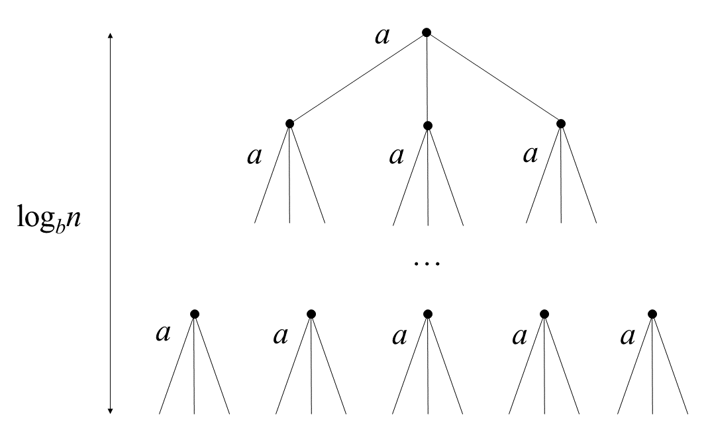

## 算法的基本概念

算法(Algorithm)是对特定问题求解步骤的一种描述， 它是指令的有限序列，其中的每条指令表示一一个或多个操作。此外，一个算法还具有 下列5个重要特性:

1. 有穷性。一个算法必须总在执行有穷步之后结束，且每一步都可在有穷时间内完成。
2. 确定性。算法中每条指令必须有确切的含义，对于相同的输入只能得出相同的输出。
3. 可行性。算法中描述的操作都可以通过已经实现的基本运算执行有限次来实现。
4. 输入。一个算法有零个或多个输入，这些输入取自于某个特定的对象的集合。
5. 输出。一个算法有-一个或多个输出，这些输出是与输入有着某种特定关系的量。通常，设计一个“好”的算法应考虑达到以下目标:

5. 可读性。算法应具有良好的可读性，以帮助人们理解。

## 算法效率的度量

算法效率的度量是通过时间复杂度和空间复杂度来描述的。

### 时间复杂度

一个语句的频度是指该语句在算法中被重复执行的次数。算法中所有语句的频度之和记为 $T(n)$,它是该算法问题规模n的函数，时间复杂度主要分析 $T(n)$ 的数量级。一般情况下，算法中基本操作可执行的次数是问题规模中 $n$ 的某个函数 $f(n)$ 。算法的时间量度记作
$$
T(n) = O(f(n))
$$
它表示随着问题规模 $n$ 的增大，算法执行时间的增长率和 $f(n)$ 的增长率相同。称作算法的  **渐进时间复杂度** 简称 **时间复杂度** 。

算法的时间复杂度不仅依赖于问题的规模n，也取决于待输入数据的性质(如输入数据元素的初始状态)。例如，在数组$A[0\sim n-1]$中，查找给定值k的算法大致如下:

```c
(1) i = n-1;
(2) while(i>0&&A[i]!=k))
(3) i--;
(3) return i;
```

该算法中语句3(基本运算)的频度不仅与问题规模力$n$有关，而且与输入实例中A的各元素的取值及k的取值有关:

①若 $A$ 中没有与 $k$ 相等的元素，则语句3的频度 $f(n)=n$。

②若 $A$ 的最后一个元素等于 $k$ ,则语句3的频度 $f(n)$ 是常数0。

1. **最坏时间复杂度是指在最坏情况下，算法的时间复杂度。**2. **平均时间复杂度是指所有可能输入实例在等概率出现的情况下，算法的期望运行时间。**3. **最好时间复杂度是指在最好情况下，算法的时间复杂度。**

在分析一个程序的时间复杂性时，有以下两条规则:

a)加法规则

$$
T(n)= T_1(n)+ T_2(n)= O(f(n)) + O(g(n)) = O(max(f(n), g(n)))
$$


b)乘法规则
$$
T(n)= T_1(n)*T_2(n)= O(f(n))*O(g(n))=O(f(n)*g(n))
$$


常见的渐近时间复杂度为

$$
O(1)< O(\log_2n) < 0(n) < O(n\log_2n) < O(n^2)< O(n^3)< )(2^n)<0(n!)<O(n^n)
$$

### 渐近记号

| 记号         | 含义         | 通俗理解   |
| ------------ | ------------ | ---------- |
| (1) $\Theta$ | 紧确界。     | 相当于"="  |
| (2) $O$      | 上界。       | 相当于"<=" |
| (3) $o$      | 非紧的上界。 | 相当于"<"  |
| (4) $\Omega$ | 下界。       | 相当于">=" |

### 空间复杂度

算法的空间复杂度S(n)定义为该算法所耗费的存储空间，它是问题规模n的函数。记为

$$
S(n)= O(g(n))
$$


一个程序 在执行时除需要存储空间来存放本身所用的指令、常数、变量和输入数据外，还需要一些对数据进行操作的工作单元和存储一些为实现计算所需信息的辅助空间。若输入数据所空间只取决于问题本身，和算法无关，则只需分析除输入和程序之外的额外空间。

# 主定理

主定理（Master Theorem)提供了用于分析一类有递归结构算法时间复杂度的方法。这种递归算法通常有这样的结构：

```python
def solve(problem):
    solve_without_recursion()
    for subProblem in problem:
        solve(subProblem)
```

我们可以用一种表示方式来概括这些结构的算法：对于一个规模为 $n$ 的问题，我们把它分为 $a$ 个子问题，每个子问题规模为 $\cfrac{n}{b}$ 。那么这种方法的复杂度 $T(n)$ 可以表示为：
$$
T(n)  = aT(\cfrac{n}{b})+f(n)
$$
其中 $a≥1,b>1$ 为常数，$\cfrac{n}{b}$ 指 $\lfloor \frac{n}{b}\rfloor$ 或者 $\lceil \frac{n}{b}\rceil$ ，主定理对 $f(n)$ 分了三种情况

1. 若 $f(n)<n^{\log_b a}$ , 且是多项式的小于。即 $\exists \varepsilon >0,s.t. f(n) = O(n^{log_b a-\epsilon})$ 。则 $T(n) = \Theta(n^{\log_b a})$
2. $f(n) = n^{\log_b a}\lg n,则 T(n) = \Theta(n^{\log_b a}\lg n)$
3. 若 $f(n)>n^{\log_b a}$ , 且是多项式的大于。即$\exist \varepsilon >0,s.t. f(n) = O(n^{log_b a+\epsilon})$，且$\exist c<1$，当 $n$ 足够大时，有 $af(\frac{n}{b})\leq cf(n)$。此时$T(n) = \Theta(f(n))$。

$$
N = a^[log(a)(N)] a = b^[log(b)(a)] 
$$

### 分析

对这个方法我们可以建一个递归树：



对于一个规模为 $n$ 的问题，我们把它分为 $a$ 个子问题，每个子问题规模为 $\cfrac{n}{b}$ 。那么这种方法的复杂度 $T(n)$ 可以表示为：
$$
\begin{aligned}
T(n) & = aT(\cfrac{n}{b}) +f(n)  \\
& = a[aT(\frac{n}{b^2})+f(\cfrac{n}{b})] +f(n)  \\
& = a^2 T(\cfrac{n}{b^2}) + af(\cfrac{n}{b}) + f(n) \\
& = \cdots
\end{aligned}
$$
其中树高为 $\log_b n=k$ ，树的第 $i$ 层有 $a^i$ 个节点，每个节点的问题规模为$\cfrac{n}{b}$。则这棵树有 $a^{\log_b n} = n^{\log_b a}$ 个叶子节点。
$$
\begin{aligned}
T(n) & = a^k T(\cfrac{n}{b^k})+a^{k-1}f(\cfrac{n}{b^{k-1}})+ \cdots +af(\cfrac{n}{b})+f(n) \\
& = a^kT(1) +\sum_{i=0}^{k-1} a^i f(\cfrac{n}{b^i})  \\
& = c_1 n^{\log_b a} +\sum_{i=0}^{k-1} a^i f(\cfrac{n}{b^i}) \quad\quad 其中令T(1)=c_1常数
\end{aligned}
$$

###  Case1证明

令$g(n)=\sum_{i=0}^{k-1}a^if(\frac{n}{b^i})$ ,由 $f(n)=O(n^{\log_ba-\varepsilon})$ 得
$$
\begin{aligned}
g(n) & =\sum_{i=0}^{k-1}a^iO\Big(\Big(\frac{n}{b^i}\Big)^{\log_ba-\varepsilon}\Big)  \\
& = O\Big(\sum_{i=0}^{\log_bn-1}a^i\Big(\frac{n}{b^i}\Big)^{\log_ba-\varepsilon}\Big)   \quad \quad 时间复杂度乘法规则 \\
\end{aligned}
$$
之后就是对后面式子的化简：
$$
\begin{aligned}
    \sum_{i=0}^{k-1}a^i\Big(\frac{n}{b^i}\Big)^{\log_ba-\varepsilon} &= n^{\log_ba-\varepsilon}\sum_{i=0}^{k-1}\Big(\frac{a}{b^{\log_b a-\varepsilon}}\Big)^i  \\
    &= n^{\log_ba-\varepsilon}\sum_{i=0}^{k-1}\Big(\frac{ab^\varepsilon}{b^{\log_ba}}\Big)^i  \\
    &= n^{\log_ba-\varepsilon}\sum_{i=0}^{k-1}(b^\varepsilon)^i  \quad\quad 由于k=\log_b n\\
    &= n^{\log_ba-\varepsilon}\Big(\frac{(b^\varepsilon)^{\log_bn}-1}{b^\varepsilon-1}\Big)  \\
    &= n^{\log_ba-\varepsilon}\Big(\frac{n^\varepsilon-1}{b^\varepsilon-1}\Big)
\end{aligned}
$$
因此$g(n)=O(\sum_{i=0}^{\log_bn-1}a^i(\frac{n}{b^i})^{\log_ba-\varepsilon})=O(n^{\log_ba})$ ，所以有：
$$
T(n)=c_1 n^{\log_b a}+O(n^{\log_ba})=\Theta(n^{\log_ba})
$$

###  Case2证明
