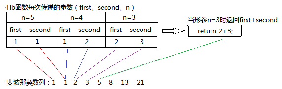

## 算法的基本概念

算法(Algorithm)是对特定问题求解步骤的一种描述， 它是指令的有限序列，其中的每条指令表示一一个或多个操作。此外，一个算法还具有 下列5个重要特性:

1. 有穷性。一个算法必须总在执行有穷步之后结束，且每一步都可在有穷时间内完成。
2. 确定性。算法中每条指令必须有确切的含义，对于相同的输入只能得出相同的输出。
3. 可行性。算法中描述的操作都可以通过已经实现的基本运算执行有限次来实现。
4. 输入。一个算法有零个或多个输入，这些输入取自于某个特定的对象的集合。
5. 输出。一个算法有-一个或多个输出，这些输出是与输入有着某种特定关系的量。通常，设计一个“好”的算法应考虑达到以下目标:

5. 可读性。算法应具有良好的可读性，以帮助人们理解。

## 算法效率的度量

算法效率的度量是通过时间复杂度和空间复杂度来描述的。

### 时间复杂度

一个语句的频度是指该语句在算法中被重复执行的次数。算法中所有语句的频度之和记为 $T(n)$,它是该算法问题规模n的函数，时间复杂度主要分析 $T(n)$ 的数量级。一般情况下，算法中基本操作可执行的次数是问题规模中 $n$ 的某个函数 $f(n)$ 。算法的时间量度记作
$$
T(n) = O(f(n))
$$
它表示随着问题规模 $n$ 的增大，算法执行时间的增长率和 $f(n)$ 的增长率相同。称作算法的  **渐进时间复杂度** 简称 **时间复杂度** 。

算法的时间复杂度不仅依赖于问题的规模n，也取决于待输入数据的性质(如输入数据元素的初始状态)。例如，在数组$A[0\sim n-1]$中，查找给定值k的算法大致如下:

```c
(1) i = n-1;
(2) while(i>0&&A[i]!=k))
(3) i--;
(3) return i;
```

该算法中语句3(基本运算)的频度不仅与问题规模力$n$有关，而且与输入实例中A的各元素的取值及k的取值有关:

①若 $A$ 中没有与 $k$ 相等的元素，则语句3的频度 $f(n)=n$。

②若 $A$ 的最后一个元素等于 $k$ ,则语句3的频度 $f(n)$ 是常数0。

1. **最坏时间复杂度是指在最坏情况下，算法的时间复杂度。**2. **平均时间复杂度是指所有可能输入实例在等概率出现的情况下，算法的期望运行时间。**3. **最好时间复杂度是指在最好情况下，算法的时间复杂度。**

在分析一个程序的时间复杂性时，有以下两条规则:

a)加法规则

$$
T(n)= T_1(n)+ T_2(n)= O(f(n)) + O(g(n)) = O(max(f(n), g(n)))
$$


b)乘法规则
$$
T(n)= T_1(n)*T_2(n)= O(f(n))*O(g(n))=O(f(n)*g(n))
$$


常见的渐近时间复杂度为

$$
O(1)< O(\log_2n) < 0(n) < O(n\log_2n) < O(n^2)< O(n^3)< )(2^n)<0(n!)<O(n^n)
$$

### 渐近记号

| 记号         | 含义         | 通俗理解   |
| ------------ | ------------ | ---------- |
| (1) $\Theta$ | 紧确界。     | 相当于"="  |
| (2) $O$      | 上界。       | 相当于"<=" |
| (3) $o$      | 非紧的上界。 | 相当于"<"  |
| (4) $\Omega$ | 下界。       | 相当于">=" |

提醒$\Theta$只是相对要求严格，并不完全相对等于数学上$=$，只是表示算法的精确阶。

### 空间复杂度

算法的空间复杂度S(n)定义为该算法所耗费的存储空间，它是问题规模n的函数。记为

$$
S(n)= O(g(n))
$$


一个程序 在执行时除需要存储空间来存放本身所用的指令、常数、变量和输入数据外，还需要一些对数据进行操作的工作单元和存储一些为实现计算所需信息的辅助空间。若输入数据所空间只取决于问题本身，和算法无关，则只需分析除输入和程序之外的额外空间。

## 主定理

主定理（Master Theorem)提供了用于分析一类有递归结构算法时间复杂度的方法。这种递归算法通常有这样的结构：

```python
def solve(problem):
    solve_without_recursion()
    for subProblem in problem:
        solve(subProblem)
```

我们可以用一种表示方式来概括这些结构的算法：对于一个规模为 $n$ 的问题，我们把它分为 $a$ 个子问题，每个子问题规模为 $\cfrac{n}{b}$ 。那么这种方法的复杂度 $T(n)$ 可以表示为：
$$
T(n)  = aT(\cfrac{n}{b})+f(n)
$$
由递归式 $T(n)=aT(n/b)+f(n)$ 对非负整数定义,其中 $a≥1,b>1$ 为常数, $f(n)$ 为一函数,则:
$$
T(n) = \left\{ \begin{array}{l} \Theta ({n^{{{\log }_b}a}}),\exists \varepsilon  > 0,f(n) = O({n^{{{\log }_b}a - \varepsilon }})\\ \Theta ({n^{{{\log }_b}a}}\lg n),f(n) = \Theta ({n^{{{\log }_b}a}})\\ \Theta (f(n)),\exists \varepsilon  > 0,f(n) = \Omega {\kern 1pt} ({n^{{{\log }_b}a + \varepsilon }}){\kern 1pt} {\kern 1pt} {\kern 1pt} {\kern 1pt} and{\kern 1pt} {\kern 1pt} {\kern 1pt} {\kern 1pt} \exists c < 1,{n_0} > 0,for{\kern 1pt} {\kern 1pt} {\kern 1pt} {\kern 1pt} n > {n_0},af(n/b) \le cf(n) \end{array} \right.
$$

### 分析

对这个方法我们可以建一个递归树：


对于一个规模为 $n$ 的问题，我们把它分为 $a$ 个子问题，每个子问题规模为 $\cfrac{n}{b}$ 。那么这种方法的复杂度 $T(n)$ 可以表示为：
$$
\begin{aligned}
T(n) & = aT(\cfrac{n}{b}) +f(n)  \\
& = a[aT(\frac{n}{b^2})+f(\cfrac{n}{b})] +f(n)  \\
& = a^2 T(\cfrac{n}{b^2}) + af(\cfrac{n}{b}) + f(n) \\
& = \cdots
\end{aligned}
$$
其中树高为 $\log_b n=k$ ，树的第 $i$ 层有 $a^i$ 个节点，每个节点的问题规模为$\cfrac{n}{b}$。则这棵树有 $a^{\log_b n} = n^{\log_b a}$ 个叶子节点。
$$
\begin{aligned}
T(n) & = a^k T(\cfrac{n}{b^k})+a^{k-1}f(\cfrac{n}{b^{k-1}})+ \cdots +af(\cfrac{n}{b})+f(n) \\
& = a^kT(1) +\sum_{i=0}^{k-1} a^i f(\cfrac{n}{b^i})  \\
& = c_1 n^{\log_b a} +\sum_{i=0}^{k-1} a^i f(\cfrac{n}{b^i}) \quad\quad 其中令T(1)=c_1常数
\end{aligned}
$$

###  Case1证明

令$g(n)=\sum_{i=0}^{k-1}a^if(\frac{n}{b^i})$ ,由 $f(n)=O(n^{\log_ba-\varepsilon})$ 得
$$
\begin{aligned}
g(n) & =\sum_{i=0}^{k-1}a^iO\Big(\Big(\frac{n}{b^i}\Big)^{\log_ba-\varepsilon}\Big)  \\
& = O\Big(\sum_{i=0}^{\log_bn-1}a^i\Big(\frac{n}{b^i}\Big)^{\log_ba-\varepsilon}\Big)   \quad \quad 时间复杂度乘法规则 \\
\end{aligned}
$$
之后就是对后面式子的化简：
$$
\begin{aligned}
    \sum_{i=0}^{k-1}a^i\Big(\frac{n}{b^i}\Big)^{\log_ba-\varepsilon} &= n^{\log_ba-\varepsilon}\sum_{i=0}^{k-1}\Big(\frac{a}{b^{\log_b a-\varepsilon}}\Big)^i  \\
    &= n^{\log_ba-\varepsilon}\sum_{i=0}^{k-1}\Big(\frac{ab^\varepsilon}{b^{\log_ba}}\Big)^i  \\
    &= n^{\log_ba-\varepsilon}\sum_{i=0}^{k-1}(b^\varepsilon)^i  \quad\quad 由于k=\log_b n\\
    &= n^{\log_ba-\varepsilon}\Big(\frac{(b^\varepsilon)^{\log_bn}-1}{b^\varepsilon-1}\Big)  \\
    &= n^{\log_ba-\varepsilon}\Big(\frac{n^\varepsilon-1}{b^\varepsilon-1}\Big)
\end{aligned}
$$
因此$g(n)=O(\sum_{i=0}^{\log_bn-1}a^i(\frac{n}{b^i})^{\log_ba-\varepsilon})=O(n^{\log_ba})$ ，所以有：
$$
T(n)=c_1 n^{\log_b a}+O(n^{\log_ba})=\Theta(n^{\log_ba})
$$

###  Case2证明

$$
\begin{aligned}
T(n) & = c_1 n^{\log_b a} +\sum_{i=0}^{k-1} a^i f(\cfrac{n}{b^i}) \\
& =c_1 n^{\log_b a}+ \Theta\Big(\sum_{i=0}^{k-1}a^i\Big(\frac{n}{b^i}\Big)^{\log_ba}\Big) \quad \quad 由于k=\log_bn \\
& =c_1 n^{\log_b a}+ \Theta\Big(n^{\log_ba}\sum_{i=0}^{\log_bn-1}\Big(\frac{a}{b^{\log_ba}}\Big)^i\Big) \\
& = c_1 n^{\log_b a}+\Theta(n^{\log_ba}\log n)=\Theta(n^{\log_ba}\log n) 
\end{aligned}
$$

### Case3证明

Case 3这里有一个条件：$a\, f(\frac{n}{b})\le c\, f(n)$，我们对这个条件做一下处理：
$$
\begin{aligned}
    a\, f\Big(\frac{n}{b}\Big) &\le c\, f(n)\\
    \Rightarrow f\Big(\frac{n}{b}\Big) &\le \frac{c}{a}f(n)\\
    \Rightarrow f\Big(\frac{n}{b^2}\Big) &\le \frac{c}{a}f\Big(\frac nb\Big)\le\Big(\frac{c}{a}\Big)^2f(n)\\
    &\vdots\\
    f\Big(\frac{n}{b^i}\Big) &\le\Big(\frac{c}{a}\Big)^if(n)\\
    \Rightarrow a^i\, f\Big(\frac{n}{b^i}\Big) &\le c^i\, f(n)\\
\end{aligned}
$$
由此我们可以很轻易的向下化简
$$
\begin{aligned}
T(n) & = c_1 n^{\log_b a} +\sum_{i=0}^{k-1} a^i f(\cfrac{n}{b^i}) \\
& \leq c_1 n^{\log_b a} + \sum_{i=0}^{k-1} c^i f(n)  \\
& = c_1 n^{\log_b a} + f(n)\frac{c^{\log_bn}-1}{c-1} \\
& = c_1n^{\log_ba} + \Theta(f(n)) \\
& = \Theta(f(n))
\end{aligned}
$$

## 斐波那契数的时间复杂度


### 递归法


```python
def fib_recur(n):
    assert n >= 0, "n > 0"
    if n <= 1:
        return n
    return fib_recur(n-1) + fib_recur(n-2)

for i in range(1, 20):
    print(fib_recur(i), end=' ')
```

写法最简洁，但是效率最低，会出现大量的重复计算，时间复杂度紧界$\Theta((\cfrac{1+\sqrt{5}}{2})^n)$ ,斐波那契数列通项公式公式
$$
a_n = 1/\sqrt{5}\bigg [\bigg (\cfrac{1+\sqrt{5}}{2}\bigg )^n-\bigg (\cfrac{1-\sqrt{5}}{2}\bigg )^n \bigg ]
$$
解释说明：斐波那契数的本质$F(n)=F(n-1)+F(n-2)$，

我们计算$F(n-1)$的时间记作$T(n-1)$，则$F(n-2)$的时间为$T(n-2)$

其中把$T(n-1)$和$T(n-2)$两者相加的时间复杂度为1，那么有$T(n)=T(n-1)+T(n-2)+1$，

式子两边同时加 1，$T(n)+1=(T(n-1)+1)+(T(n-2)+1)$，

记$A(n)=T(n)+1$，那么有一新的斐波那契数列$A(n)=A(n-1)+A(n-2)$，

 $A(n)$ 的渐进增长率与 $F(n)$ 相同，斐波那契数列的通项公式为$a_n =1/\sqrt{5}\bigg [\bigg (\cfrac{1+\sqrt{5}}{2}\bigg )^n-\bigg (\cfrac{1-\sqrt{5}}{2}\bigg )^n \bigg ]$。

因此斐波那契数列时间复杂度为$\Theta((\cfrac{1+\sqrt{5}}{2})^n)$

### 递推法 

```python
def fib_loop_for(n):
    a, b = 0, 1
    for _ in range(n):
        a, b = b, a + b
    return a

for i in range(20):
    print(fib_loop_for(i), end=' ')
```

递推法，就是递增法，时间复杂度是 O(n)，呈线性增长，如果数据量巨大，速度会越拖越慢

### 矩阵法

$$
\left( \begin{matrix}
f(n) \\ f(n-1)
\end{matrix} \right)=
\left( \begin{matrix}
1 &1 \\ 1 &0
\end{matrix} \right)
\left( \begin{matrix}
f(n-1) \\ f(n-2)
\end{matrix} \right)
$$

$$
\left( \begin{matrix}
f(n) \\ f(n-1)
\end{matrix} \right)=
\left( \begin{matrix}
1 &1 \\ 1 &0
\end{matrix} \right)
\left( \begin{matrix}
f(n-1) \\ f(n-2)
\end{matrix} \right)=\cdots=
\left( \begin{matrix}
1 &1 \\ 1 &0
\end{matrix} \right)^{n-2}
\left( \begin{matrix}
f(2) \\ f(1)
\end{matrix} \right)
$$

```python
import numpy as np

def fib_matrix(n):
    for i in range(n):
        res = pow((np.matrix([[1, 1], [1, 0]], dtype='int64')), i) * np.matrix([[1], [0]])
        print(int(res[0][0]))
print(fib_matrix(50))
```

因为幂运算可以使用二分加速，所以矩阵法的时间复杂度为 $\Theta(\log n)$,用科学计算包numpy来实现矩阵法$\Theta(\log n)$

## 斐波那契数的空间复杂度

### 方法一：递归


①-③：调用Fib(5),首先需调用Fib(4),Fib(4)要先调用Fib(3)，逐步调用直至返回Fib(2)的值1，Fib执行结束，所创建空间销毁。此时Fib(5)、Fib(4)、Fib(3)均未调用结束，程序共占用4个函数栈帧空间。

④-⑨：Fib(2)执行结束，接下来调用Fib(1)，创建一个函数栈帧空间，调用结束返回1后，该空间销毁，此时可得到Fib(3)=2，通过第⑦步返回Fib(3)的值，第⑧步同样创建空间再次调用Fib(2)，调用结束销毁空间，此时可得到Fib(4)=3，通过第⑨步返回Fib(4)的值，此过程最大占用4个函数栈帧空间。

⑩-···：最后和上面一样，调用Fib(3)，将返回值传给Fib(5)的模块，最终得到Fib(5)=5。

整个程序执行过程中，最多占用4个函数栈帧空间的大小，设一个函数栈帧空间为C
因此可得知当n=5时，该程序空间复杂度为O(4C)=>O(1)
当求第n个斐波那契数时，程序空间复杂度为O(n-1)C (n是常数)=>O(1)

### 方法二：循环

```python
def fib_loop_for(n):
    a, b = 0, 1
    for _ in range(n):
        a, b = b, a + b
    return a

for i in range(20):
    print(fib_loop_for(i), end=' ')
```

> [!Attention|style:flat]
> 1. 在python语法之中，不会在原有的地址空间上赋值，会另外开辟一块新的内存空间。空间复杂度为$O(n)$
> 2. 在c种该程序中创建了3个变量，即创建了3个内存空间，空间复杂度为$O(1)$


### 方法三：尾递归



```python
##斐波那契尾递归测试
def fibonacciTailRecursive(num, ret1, rte2):
    if num == 1:
        return rte2
    return fibonacciTailRecursive(num-1, rte2, ret1+rte2)

a = fibonacciTailRecursive(2, 0, 1)
print(a)
```

本质上也是一种递推循环，尾递归的方法，需开辟$n-2$个空间，空间复杂度为即$O(n)$。

