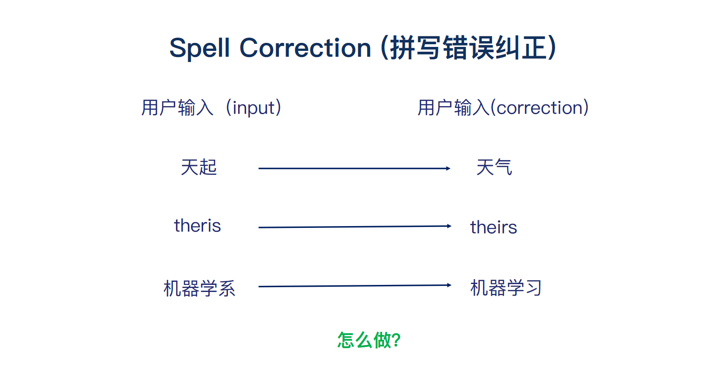
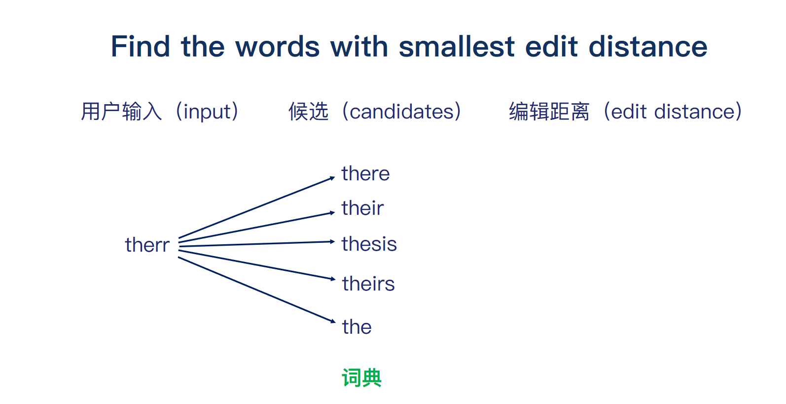
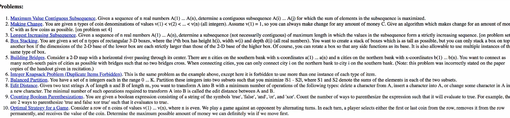
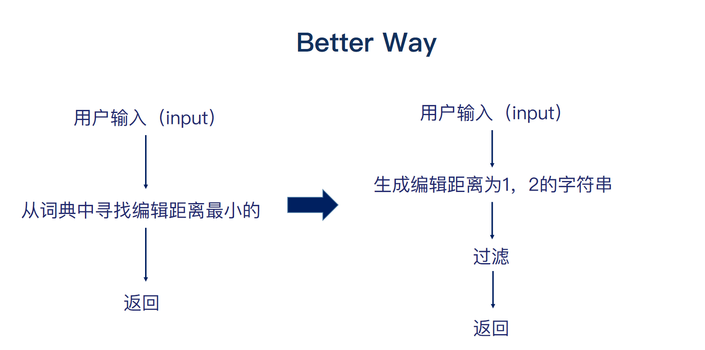
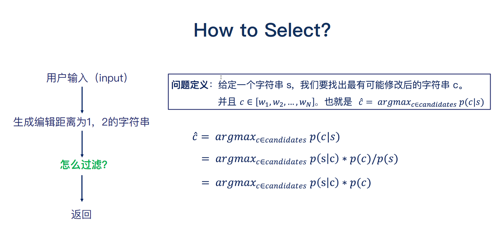

## 编辑距离



错别字分为两种情况，1. 本身就是错别字。2. 不是错别字而是不合适，语法错误啊，英语中的时态问题。



首先来阐述一下动态规划中的编辑距离问题吧。  给你两个单词 word1 和 word2，请你计算出将 word1 转换成 word2 所使用的最少操作数 。你可以对一个单词进行如下三种操作：1. 插入一个字符  2.  删除一个字符 3. 替换一个字符 

```markdown
输入：word1 = "intention", word2 = "execution"
输出：5
解释：
intention -> inention (删除 't')
inention -> enention (将 'i' 替换为 'e')
enention -> exention (将 'n' 替换为 'x')
exention -> exection (将 'n' 替换为 'c')
exection -> execution (插入 'u')
```

最后呢，计算出 **there** 和 **their**  编辑距离一样长，但是最后到底返回啥单词呢？此处就要多方面考虑。编辑距离、词频和上下文。具体使用根据你所建立的模型参数有关。

```

```


## 作业



## 过滤候选

我们通过动态规划的编辑距离，计算出需要返回的单词。问题也貌似迎刃而解了。但是文哲老师总是喜欢抛砖引玉。细细思考我们的候选单词是怎么来的，如果候选单词是整个字典的话，复杂度极高，直接pass这种想法。

此时就有一个绝妙的 **idea** 。我们基于用户的输出生成所有可能的单词。然后进行过滤就生成了我们的候选单词。





